# JARKOM MODUL 2| K-33
DNS, Master & Slave, Reverse Proxy, dll.

## Anggota

| Nama | NRP |
| :--- | :--- |
| Jonathan Steven Tjahjaputra | 5027251036 |
| Helen Audya Yuniarini | 5027251069 |
---

# Laporan

## Soal 1

### A. Penjelasan
Mengonfigurasi pengalamatan IP statis dan default gateway pada antarmuka jaringan setiap node di dalam topologi, serta mengatur konfigurasi multi-interface pada router rootkit yang terhubung ke lima switch berbeda dan mengarah ke DHCP internet.

### B. Konfigurasi
```sh
# Conf di Rootkit
auto eth0
iface eth0 inet dhcp

auto eth1
iface eth1 inet static
    address 10.80.1.1
    netmask 255.255.255.0

auto eth2
iface eth2 inet static
    address 10.80.2.1
    netmask 255.255.255.0

auto eth3
iface eth3 inet static
    address 10.80.3.1
    netmask 255.255.255.0

auto eth4
iface eth4 inet static
    address 10.80.4.1
    netmask 255.255.255.0

auto eth5
iface eth5 inet static
    address 10.80.5.1
    netmask 255.255.255.0

# Conf setiap node
auto eth0
iface eth0 inet static
    address 10.80.x.x
    netmask 255.255.255.0
    gateway 10.80.x.x
    up rm -f /etc/resolv.conf && echo "nameserver 192.168.122.1" > /etc/resolv.conf
```

Berikut adalah pemetaan rincian alamat IP dan default gateway untuk seluruh node dalam topologi:

| Node | Address | Gateway |
| --- | --- | --- |
| **alpha** | 1.2 | 1.1 |
| **beta** | 1.3 | 1.1 |
| **gamma** | 2.2 | 2.1 |
| **delta** | 2.3 | 2.1 |
| **epsilon** | 2.4 | 2.1 |
| **abbey** | 3.2 | 3.1 |
| **penny** | 4.2 | 4.1 |
| **prab** | 5.2 | 5.1 |
| **tedd** | 5.3 | 5.1 |
| **obladi** | 5.4 | 5.1 |
| **desmond** | 5.5 | 5.1 |
| **oblada** | 5.6 | 5.1 |
| **molly** | 5.7 | 5.1 |

Router rootkit dikonfigurasi dengan `eth0` yang menerima IP via DHCP untuk jalur internet luar, sedangkan `eth1` hingga `eth5` difungsikan sebagai IP gateway masing-masing subnet switch (`10.80.1.1` sampai `10.80.5.1`). Setiap node klien dan server menetapkan antarmuka `eth0` dengan IP statis di segmen subnetnya, mengarahkan gateway ke IP antarmuka rootkit yang sesuai, dan mengeset DNS awal ke IP NAT gateway (`192.168.122.1`).

### C. Pengujian

* Verifikasi Penugasan IP Interface Klien/Server
```sh
  ip a show eth0
```
  Expected Output:
  Menampilkan rincian status antarmuka eth0 berstatus UP beserta alokasi IP statis (`10.80.x.x/24`) sesuai node terkait.
  Membuktikan: Alokasi pengalamatan IP statis berhasil diterapkan pada antarmuka jaringan node.

* Uji Konektivitas Antar-Node / Gateway
```sh
  ping -c 3 10.80.x.x
```
  Expected Output:
  Tiga respons `ICMP` berhasil diterima (`3 packets transmitted`, `3 received`, `0% packet loss`).
  Membuktikan: Lapisan jaringan antar-node dalam topologi dapat saling terhubung tanpa ada paket yang hilang.

* Uji Konektivitas ke Gateway NAT/Internet
```sh
  ping -c 3 192.168.122.1
```
  Expected Output:
  Respons balasan `ICMP` diterima normal (`0% packet loss`).
  Membuktikan: Rute keluar menuju gateway jaringan `NAT` telah terbuka dari antarmuka node.

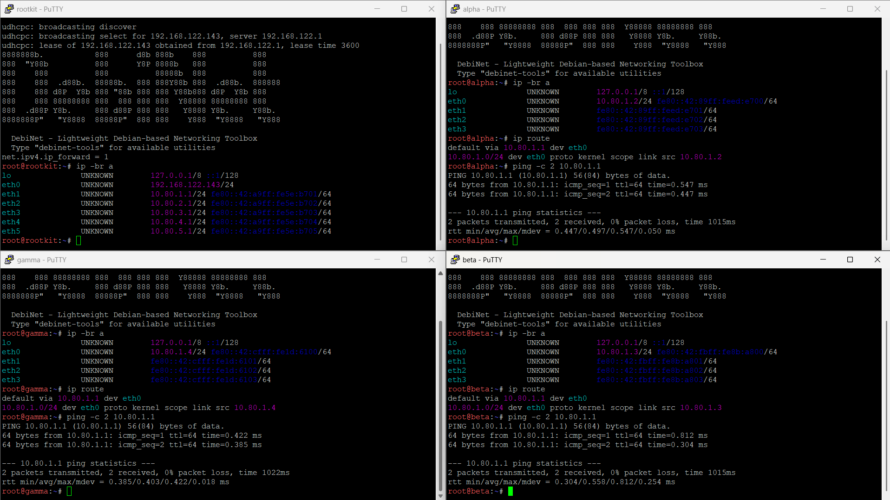
---

## Soal 2

### A. Penjelasan
Mengaktifkan penerusan paket `IPv4` (`IP forwarding`) dan aturan translasi alamat jaringan (`NAT Masquerade`) pada router rootkit agar seluruh node di subnet internal dapat mengakses jaringan internet luar melalui antarmuka `eth0`.

### B. Konfigurasi
```sh
# Conf di Rootkit
up sysctl -w net.ipv4.ip_forward=1
up iptables -P FORWARD ACCEPT
up iptables -F FORWARD
up iptables -t nat -F
up iptables -t nat -A POSTROUTING -o eth0 -j MASQUERADE
```

Arahan `up` mengaktifkan parameter kernel Linux `net.ipv4.ip_forward=1` secara otomatis saat antarmuka jaringan dinaikkan agar kernel mengizinkan routing paket antar-subnet. Rantai `FORWARD` dibuka agar lalu lintas tidak terblokir, tabel `NAT` dibersihkan, lalu ditambahkan aturan rantai `POSTROUTING` dengan aksi target `MASQUERADE` pada antarmuka keluar `eth0`, sehingga seluruh paket data dari jaringan lokal internal diterjemahkan ke IP publik milik router `rootkit` saat menuju internet.

### C. Pengujian

* Verifikasi Kernel IP Forwarding pada Router
```sh
cat /proc/sys/net/ipv4/ip_forward
```
  Expected Output:
  `1`
  Membuktikan: Kernel router rootkit telah aktif dan siap meneruskan trafik antar-subnet.

* Verifikasi Aturan IPTables POSTROUTING NAT
```sh
iptables -t nat -L POSTROUTING -n -v
```
  Expected Output:
  Terdapat baris aturan berstatus target `MASQUERADE` pada antarmuka `-o eth0`.
  Membuktikan: Fitur Source Network Address Translation (SNAT/Masquerade) telah terdaftar di tabel `NAT` firewall rootkit.

* Uji Akses Internet dari Klien Bebas
```sh
ping -c 3 192.168.122.1
```
  Expected Output:
  Respons balasan `ICMP` berhasil diterima (`3 packets transmitted`, `3 received`, `0% packet loss`).
  Membuktikan: Node internal berhasil menyeberangi router rootkit dan menjangkau gateway `NAT` internet.

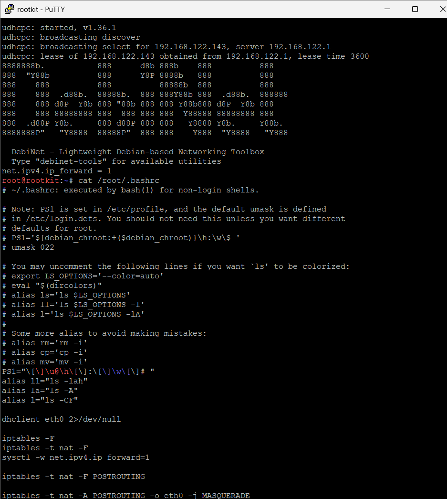
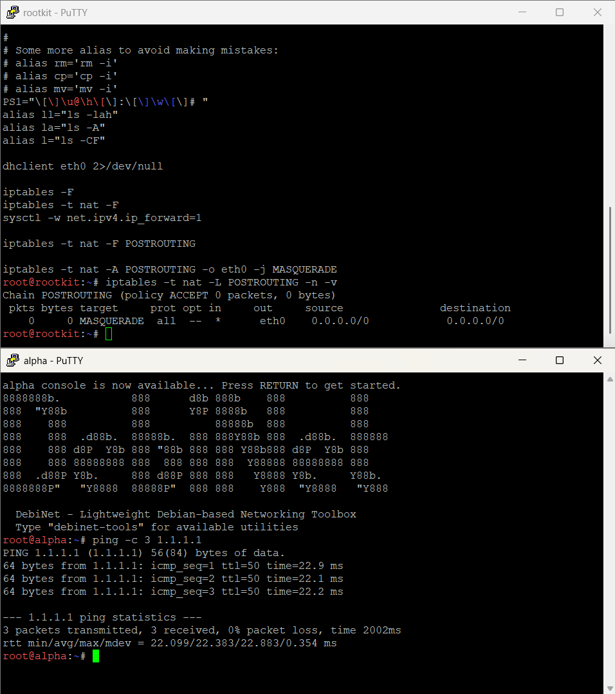

---

## Soal 3

### A. Penjelasan
Mengatur berkas `/etc/resolv.conf` pada setiap klien internal agar mengarah langsung ke DNS resolver gateway `NAT` (`192.168.122.1`) sehingga node dapat langsung terhubung ke repository paket eksternal saat proses instalasi dependensi awal.

### B. Konfigurasi
```sh
# Conf di Masing-masing klien
up rm -f /etc/resolv.conf && echo "nameserver 192.168.122.1" > /etc/resolv.conf
```

File penunjuk DNS bawaan dihapus secara paksa untuk menghindari konflik berkas symlink, kemudian dituliskan baris `nameserver 192.168.122.1` secara otomatis saat interface jaringan dijalankan (`up`).

### C. Pengujian

* Pemeriksaan Isi Berkas Resolv.conf Klien
```sh
cat /etc/resolv.conf
```
  Expected Output:
  Menampilkan baris IP `nameserver` resolver gateway (`nameserver 192.168.122.1`), atau mencantumkan IP `nameserver` internal tambahan dari konfigurasi lanjutan.
  Membuktikan: Node klien telah memiliki resolver DNS aktif untuk menerjemahkan alamat domain publik/internal.

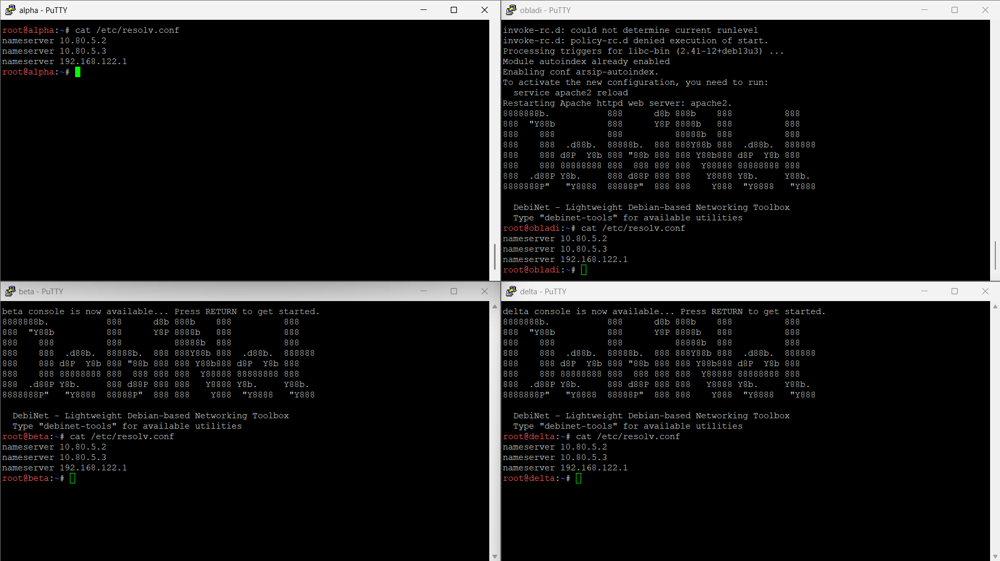

---

## Soal 4

### A. Penjelasan
Membangun infrastruktur DNS berbasis BIND9 dengan skema Master DNS pada node `prab` dan Slave DNS (Zone Transfer) pada node `tedd` untuk domain `Kel33.com` serta zona reverse DNS subnet.

### B. Konfigurasi
```sh
# Conf Master ke Prab
# Yang ini nginstall bind9
up which named || (apt-get update && apt-get install -y bind9 bind9-dnsutils)
up mkdir -p /etc/bind/zones

# Di bagian akhir banget, tambahin ini buat ngerestart
up /etc/init.d/named restart 2>/dev/null || /etc/init.d/bind9 restart 2>/dev/null
up rm -f /etc/resolv.conf && echo -e "nameserver 10.80.5.2\nnameserver 10.80.5.3\nnameserver 192.168.122.1" > /etc/resolv.conf

# Yang ini ngeconfig Reverse Zonenya
up echo 'zone "Kel33.com" {' > /etc/bind/named.conf.local
up echo '    type master;' >> /etc/bind/named.conf.local
up echo '    file "/etc/bind/zones/db.Kel33.com";' >> /etc/bind/named.conf.local
up echo '    notify yes;' >> /etc/bind/named.conf.local
up echo '    allow-transfer { 10.80.5.3; };' >> /etc/bind/named.conf.local
up echo '};' >> /etc/bind/named.conf.local
up echo '' >> /etc/bind/named.conf.local
up echo 'zone "3.80.10.in-addr.arpa" {' >> /etc/bind/named.conf.local
up echo '    type master;' >> /etc/bind/named.conf.local
up echo '    file "/etc/bind/zones/db.10.80.3";' >> /etc/bind/named.conf.local
up echo '    notify yes;' >> /etc/bind/named.conf.local
up echo '    allow-transfer { 10.80.5.3; };' >> /etc/bind/named.conf.local
up echo '};' >> /etc/bind/named.conf.local
up echo '' >> /etc/bind/named.conf.local
up echo 'zone "4.80.10.in-addr.arpa" {' >> /etc/bind/named.conf.local
up echo '    type master;' >> /etc/bind/named.conf.local
up echo '    file "/etc/bind/zones/db.10.80.4";' >> /etc/bind/named.conf.local
up echo '    notify yes;' >> /etc/bind/named.conf.local
up echo '    allow-transfer { 10.80.5.3; };' >> /etc/bind/named.conf.local
up echo '};' >> /etc/bind/named.conf.local
up echo '' >> /etc/bind/named.conf.local
up echo 'zone "5.80.10.in-addr.arpa" {' >> /etc/bind/named.conf.local
up echo '    type master;' >> /etc/bind/named.conf.local
up echo '    file "/etc/bind/zones/db.10.80.5";' >> /etc/bind/named.conf.local
up echo '    notify yes;' >> /etc/bind/named.conf.local
up echo '    allow-transfer { 10.80.5.3; };' >> /etc/bind/named.conf.local
up echo '};' >> /etc/bind/named.conf.local

# Conf Slave ke Tedd
# Yang ini nginstall bind9
up which named || (apt-get update && apt-get install -y bind9 bind9utils dnsutils)

# Di bagian akhir banget, tambahin ini buat ngerestart
up /etc/init.d/named restart 2>/dev/null || /etc/init.d/bind9 restart 2>/dev/null
up rm -f /etc/resolv.conf && echo -e "nameserver 10.80.5.2\nnameserver 10.80.5.3\nnameserver 192.168.122.1" > /etc/resolv.conf

# Ngeconfig Slave Zonenya
up echo 'zone "Kel33.com" {' > /etc/bind/named.conf.local
up echo '    type slave;' >> /etc/bind/named.conf.local
up echo '    file "/var/cache/bind/db.Kel33.com";' >> /etc/bind/named.conf.local
up echo '    masters { 10.80.5.2; };' >> /etc/bind/named.conf.local
up echo '};' >> /etc/bind/named.conf.local
up echo '' >> /etc/bind/named.conf.local
up echo 'zone "3.80.10.in-addr.arpa" {' >> /etc/bind/named.conf.local
up echo '    type slave;' >> /etc/bind/named.conf.local
up echo '    file "/var/cache/bind/db.10.80.3";' >> /etc/bind/named.conf.local
up echo '    masters { 10.80.5.2; };' >> /etc/bind/named.conf.local
up echo '};' >> /etc/bind/named.conf.local
up echo '' >> /etc/bind/named.conf.local
up echo 'zone "4.80.10.in-addr.arpa" {' >> /etc/bind/named.conf.local
up echo '    type slave;' >> /etc/bind/named.conf.local
up echo '    file "/var/cache/bind/db.10.80.4";' >> /etc/bind/named.conf.local
up echo '    masters { 10.80.5.2; };' >> /etc/bind/named.conf.local
up echo '};' >> /etc/bind/named.conf.local
up echo '' >> /etc/bind/named.conf.local
up echo 'zone "5.80.10.in-addr.arpa" {' >> /etc/bind/named.conf.local
up echo '    type slave;' >> /etc/bind/named.conf.local
up echo '    file "/var/cache/bind/db.10.80.5";' >> /etc/bind/named.conf.local
up echo '    masters { 10.80.5.2; };' >> /etc/bind/named.conf.local
up echo '};' >> /etc/bind/named.conf.local
```

Node `prab` didefinisikan sebagai master DNS yang mengizinkan transfer zona (`allow-transfer`) dan mengirimkan sinyal pembaruan (`notify yes`) khusus ke node `tedd` (`10.80.5.3`). Node `tedd` dikonfigurasi sebagai server slave yang mereplikasi seluruh berkas zona dari `prab` (`masters { 10.80.5.2; };`) dan menyimpannya di `/var/cache/bind/`. `Resolv.conf` kedua server diarahkan berurutan ke master, slave, lalu internet `NAT`.

### C. Pengujian

* Uji SOA Record pada DNS Master (Prab)
```sh
dig @10.80.5.2 Kel33.com SOA
```
  Expected Output:
  Menampilkan status: `NOERROR` pada bagian header serta record `SOA` domain `Kel33.com` dengan otoritas dari `ns1.Kel33.com`.
  Membuktikan: Server master `prab` aktif dan memegang otoritas penuh terhadap zona `Kel33.com`.

* Uji SOA Record & Replikasi pada DNS Slave (Tedd)
```sh
dig @10.80.5.3 Kel33.com SOA
```
  Expected Output:
  Menampilkan status: `NOERROR` dengan rincian serial number `SOA` yang identik dengan master DNS.
  Membuktikan: Server slave `tedd` berhasil melakukan sinkronisasi zona dari `prab` melalui mekanisme zone transfer.

* Uji Resolusi Record Domain & Subdomain
```sh
dig Kel33.com A +short
dig prab.Kel33.com A +short
dig tedd.Kel33.com A +short
```
  Expected Output:
  Menghasilkan IP tujuan masing-masing secara berurutan: `10.80.4.2`, `10.80.5.2`, dan `10.80.5.3`.
  Membuktikan: Query pemetaan nama domain ke alamat IP (`A Record`) berhasil di-resolve oleh server DNS internal.

* Uji Fitur DNS Forwarding ke Internet Luar
```sh
dig @10.80.5.2 google.com +short
```
  Expected Output:
  Menghasilkan daftar IP publik resmi dari domain `google.com`.
  Membuktikan: BIND9 pada `prab` berhasil meneruskan (`forward`) query domain luar ke resolver internet publik.

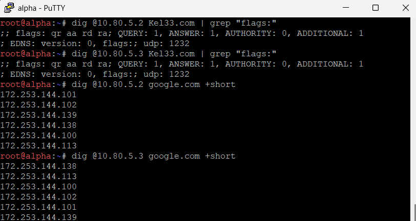

---

## Soal 5

### A. Penjelasan
Menetapkan identitas nama host (`hostname`) sistem secara permanen pada setiap node di topologi serta memastikan seluruh nama node dapat di-resolve ke IP masing-masing melalui domain `Kel33.com`.

### B. Konfigurasi
```sh
# Conf masing-masing node
up hostname (nama node)
up echo "(nama node)" > /etc/hostname
```

Skrip memperbarui nama host aktif pada memori kernel menggunakan perintah `hostname` serta menuliskannya secara permanen ke dalam berkas `/etc/hostname` saat sistem menaikkan interface jaringan.

### C. Pengujian

* Verifikasi Hostname Lokal pada Masing-Masing Node
```sh
hostname
cat /etc/hostname
```
  Expected Output:
  Menampilkan nama node yang sesuai (misal: `rootkit`, `alpha`, `abbey`, dst.) baik dari pembacaan memori runtime maupun file fisik.
  Membuktikan: Hostname sistem telah terpasang permanen pada masing-masing mesin.

* Uji Resolusi Massal DNS Hostname Seluruh Node
```sh
for host in rootkit alpha beta gamma delta epsilon abbey penny obladi desmond oblada molly; do
    echo -n "$host.Kel33.com -> "; dig +short $host.Kel33.com A
done
```
  Expected Output:
  Setiap baris menampilkan pemetaan nama host ke IP statisnya masing-masing tanpa ada baris yang kosong:
  `rootkit.Kel33.com -> `
  `alpha.Kel33.com -> 10.80.1.2`
  `beta.Kel33.com -> 10.80.1.3`
  `...`
  `molly.Kel33.com -> 10.80.5.7`
  Membuktikan: Seluruh entitas node jaringan telah terdaftar lengkap di database DNS server `Kel33.com`.

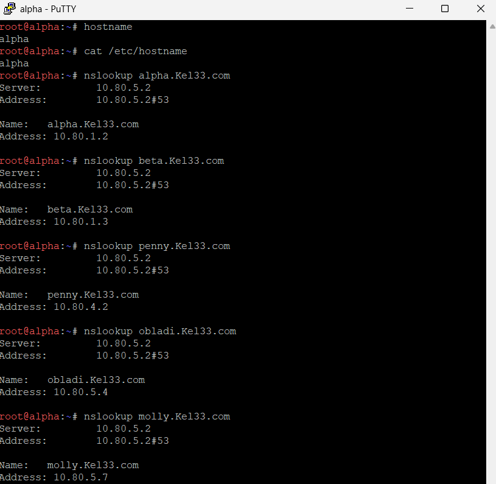

---

## SOAL 6
Memastikan bahwa mekanisme DNS Zone Transfer antara server direktori utama `prab` (Primary/Master) dan `tedd` (Secondary/Slave) berjalan dengan sukses dan konsisten. Validasi dilakukan untuk memastikan `tedd` telah menerima salinan zona terbaru dari `prab` dengan nilai serial Start of Authority (SOA) yang identik, mengingat peran keduanya yang saling melengkapi sebagai penjaga direktori di dalam The Mesh.

Konfigurasi database zona domain pada server prab diperbarui untuk mendefinisikan record SOA, Name Server (`prab` dan `tedd`), serta pemetaan IP masing-masing entitas secara lengkap. Berkas konfigurasi zona ditempatkan pada direktori `/etc/bind/zones/db.Kel33.com` dengan skrip otomatisasi interfaces (up) berikut:
```
up echo -e '$TTL 604800\n@ IN SOA prab.Kel33.com. root.Kel33.com. ( 3 604800 86400 2419200 604800 )\n@ IN NS prab.Kel33.com.\n@ IN NS tedd.Kel33.com.\n@ IN A 10.80.4.2\nprab IN A 10.80.5.2\ntedd IN A 10.80.5.3\nrootkit IN A 10.80.1.1\nalpha IN A 10.80.1.2\nbeta IN A 10.80.1.3\ngamma IN A 10.80.1.4\ndelta IN A 10.80.2.2\nepsilon IN A 10.80.2.3\nabbey IN A 10.80.3.2\npenny IN A 10.80.4.2\nobladi IN A 10.80.5.4\ndesmond IN A 10.80.5.5\noblada IN A 10.80.5.6\nmolly IN A 10.80.5.7\nvault IN A 10.80.5.4\ncore IN A 10.80.5.6\nwww IN CNAME penny.Kel33.com.\nstatic IN CNAME abbey.Kel33.com.' > /etc/bind/zones/db.Kel33.com
```
Untuk memastikan keberhasilan transfer zona, dilakukan pengujian *query* DNS menggunakan utilitas `dig` langsung dari node klien/entitas (seperti pada terminal **penny** dan **alpha**) guna memeriksa catatan SOA pada server master (`prab` di IP `10.80.5.2`) maupun server slave (`tedd` di IP `10.80.5.3`).

### A. Perintah Pengujian
```bash
dig @10.80.5.2 Kel33.com soa
dig @10.80.5.3 Kel33.com soa
```
### Dokumentasi
.png)
.png)
Saat dieksekusi perintah `dig @10.80.5.3 Kel33.com soa`, server `tedd` memberikan respons pada *Answer Section* yang menampilkan nilai serial SOA sebesar **3**.

## SOAL 7
Mendefinisikan pemetaan record DNS yang akurat untuk klaster layanan dalam jaringan The Mesh. Berdasarkan ketentuan soal, langkah yang dilakukan mencakup:
1. Menambahkan A record untuk vault.<xxxx>.com (mengarah ke IP klaster Vault seperti obladi dan desmond) serta core.<xxxx>.com (mengarah ke IP klaster Core seperti oblada dan molly).   
2. Menetapkan catatan CNAME di mana www.<xxxx>.com mengarah ke penny.<xxxx>.com dan static.<xxxx>.com mengarah ke abbey.<xxxx>.com.   
3. Mengatur zona reverse DNS (PTR record) pada server prab untuk memastikan integritas resolusi IP ke hostname.   
```
#PRAB
    up echo -e '$TTL 604800\n@ IN SOA prab.Kel33.com. root.Kel33.com. ( 1 604800 86400 2419200 604800 )\n@ IN NS prab.Kel33.com.\n@ IN NS tedd.Kel33.com.\n2 IN PTR abbey.Kel33.com.' > /etc/bind/zones/db.10.80.3
    up echo -e '$TTL 604800\n@ IN SOA prab.Kel33.com. root.Kel33.com. ( 1 604800 86400 2419200 604800 )\n@ IN NS prab.Kel33.com.\n@ IN NS tedd.Kel33.com.\n2 IN PTR penny.Kel33.com.' > /etc/bind/zones/db.10.80.4
    up echo -e '$TTL 604800\n@ IN SOA prab.Kel33.com. root.Kel33.com. ( 1 604800 86400 2419200 604800 )\n@ IN NS prab.Kel33.com.\n@ IN NS tedd.Kel33.com.\n2 IN PTR prab.Kel33.com.\n3 IN PTR tedd.Kel33.com.\n4 IN PTR vault.Kel33.com.\n5 IN PTR desmond.Kel33.com.\n6 IN PTR core.Kel33.com.\n7 IN PTR molly.Kel33.com.' > /etc/bind/zones/db.10.80.5
```
Buka terminal pada salah satu klien (misalnya alpha atau klien lainnya), lalu jalankan perintah nslookup untuk menguji semua record yang diminta di soal:


1. Menguji CNAME www:
```
nslookup www.Kel33.com
```
**`[www.Kel33.com](https://www.Kel33.com)`**: Berhasil di-*resolve* dengan status *canonical name* menuju `penny.Kel33.com` dengan alamat IP `10.80.4.2`.

2. Menguji CNAME static:
```
nslookup static.Kel33.com
```
**`static.Kel33.com`**: Berhasil di-*resolve* dengan status *canonical name* menuju `abbey.Kel33.com` dengan alamat IP `10.80.3.2`.

3. Menguji vault:
```
nslookup vault.Kel33.com
```
**`vault.Kel33.com`**: Berhasil di-*resolve* secara langsung ke alamat IP tujuan `10.80.5.4` (sesuai dengan IP *Vault* / `obladi`)..

4. Menguji core:
```
nslookup core.Kel33.com
```
**`core.Kel33.com`**: Berhasil di-*resolve* secara langsung ke alamat IP tujuan `10.80.5.6` (sesuai dengan IP *Core* / `oblada`).

## SOAL 8
Mendeklarasikan reverse zone pada server DNS master prab untuk segmen jaringan tempat entitas abbey, penny, area vault, dan area core berada. Selain itu, server slave tedd menarik reverse zone tersebut, serta mengisi record PTR agar pencarian balik (reverse lookup) IP address dapat mengembalikan hostname yang benar dan dijawab secara authoritative.
```
# Deklarasi Reverse Zone di named.conf.local
    up echo 'zone "3.80.10.in-addr.arpa" { type master; file "/etc/bind/zones/db.10.80.3"; notify yes; allow-transfer { 10.80.5.3; }; };' >> /etc/bind/named.conf.local
    up echo 'zone "4.80.10.in-addr.arpa" { type master; file "/etc/bind/zones/db.10.80.4"; notify yes; allow-transfer { 10.80.5.3; }; };' >> /etc/bind/named.conf.local
    up echo 'zone "5.80.10.in-addr.arpa" { type master; file "/etc/bind/zones/db.10.80.5"; notify yes; allow-transfer { 10.80.5.3; }; };' >> /etc/bind/named.conf.local

# Pembuatan File Database PTR untuk Abbey, Penny, Vault, dan Core
    up echo -e '$TTL 604800\n@ IN SOA prab.Kel33.com. root.Kel33.com. ( 1 604800 86400 2419200 604800 )\n@ IN NS prab.Kel33.com.\n@ IN NS tedd.Kel33.com.\n2 IN PTR abbey.Kel33.com.' > /etc/bind/zones/db.10.80.3
    up echo -e '$TTL 604800\n@ IN SOA prab.Kel33.com. root.Kel33.com. ( 1 604800 86400 2419200 604800 )\n@ IN NS prab.Kel33.com.\n@ IN NS tedd.Kel33.com.\n2 IN PTR penny.Kel33.com.' > /etc/bind/zones/db.10.80.4
    up echo -e '$TTL 604800\n@ IN SOA prab.Kel33.com. root.Kel33.com. ( 1 604800 86400 2419200 604800 )\n@ IN NS prab.Kel33.com.\n@ IN NS tedd.Kel33.com.\n2 IN PTR prab.Kel33.com.\n3 IN PTR tedd.Kel33.com.\n4 IN PTR vault.Kel33.com.\n5 IN PTR desmond.Kel33.com.\n6 IN PTR core.Kel33.com.\n7 IN PTR molly.Kel33.com.' > /etc/bind/zones/db.10.80.5
```
Setelah itu, langsung tes kembali di terminal prab:
```
dig @10.80.5.2 -x 10.80.5.4

```

1. *Query* untuk IP `10.80.5.4` diterjemahkan ke format *in-addr.arpa* (`4.5.80.10.in-addr.arpa.`) dengan tipe *PTR*.
2. Pada *Answer Section*, IP tersebut berhasil dikembalikan (*resolved*) menjadi *hostname* **`vault.Kel33.com.`** secara akurat.
3. Bendera (*flags*) pada respons menunjukkan status `aa` (*Authoritative Answer*) dengan status *NOERROR*, yang membuktikan bahwa server DNS menjawab kueri balik tersebut secara otoritatif.

## Soal 9

### A. Penjelasan
Mengonfigurasi web server Apache2 pada node backend Vault (`obladi` dan `desmond`) dengan fitur directory listing (`autoindex`) pada direktori `/arsip/` beserta file sampel arsip.

### B. Konfigurasi
```sh
# Conf ke Obladi dan Desmond
up which apache2 || (rm -f /etc/resolv.conf && echo "nameserver 192.168.122.1" > /etc/resolv.conf && apt-get update && apt-get install -y apache2)
up mkdir -p /var/www/html/arsip
up touch /var/www/html/arsip/dokumen_obladi.txt /var/www/html/arsip/catatan_vault.txt
up echo "Arsip Obladi Vault" > /var/www/html/arsip/info.txt
up echo '<Directory /var/www/html/arsip>' > /etc/apache2/conf-available/arsip-autoindex.conf
up echo '    Options +Indexes +FollowSymLinks' >> /etc/apache2/conf-available/arsip-autoindex.conf
up echo '    AllowOverride None' >> /etc/apache2/conf-available/arsip-autoindex.conf
up echo '    Require all granted' >> /etc/apache2/conf-available/arsip-autoindex.conf
up echo '</Directory>' >> /etc/apache2/conf-available/arsip-autoindex.conf
up a2enmod autoindex 2>/dev/null
up a2enconf arsip-autoindex 2>/dev/null
up /etc/init.d/apache2 restart 2>/dev/null
```

Paket Apache2 dipasang, kemudian dibuat direktori fisik `/var/www/html/arsip/` beserta beberapa file teks. Direktif Apache `Options +Indexes` diaktifkan melalui berkas konfigurasi `arsip-autoindex.conf` dan modul `autoindex` diaktifkan agar saat endpoint direktori `/arsip/` diakses via browser atau `curl`, Apache secara otomatis merender daftar file di dalamnya dalam format HTML.

### C. Pengujian

* Uji Autoindex Web Statis pada Node Obladi
```sh
curl -s http://obladi.Kel33.com/arsip/
```
  Expected Output:
  Potongan kode HTML `Index of /arsip` yang memuat tautan daftar file seperti `dokumen_obladi.txt`, `catatan_vault.txt`, dan `info.txt`.
  Membuktikan: Direktori `/arsip/` pada `obladi` dapat diakses dan fitur `autoindex` Apache aktif.

* Uji Autoindex Web Statis pada Node Desmond
```sh
curl -s http://desmond.Kel33.com/arsip/
```
  Expected Output:
  Halaman HTML serupa yang menampilkan indeks berkas arsip milik server `desmond`.
  Membuktikan: Layanan web statis dan `autoindex` pada backend kedua (`desmond`) berjalan dengan normal.

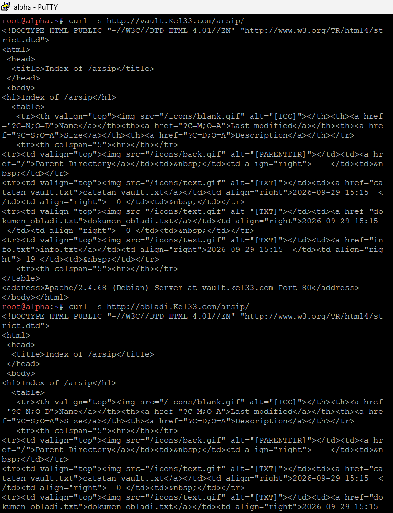
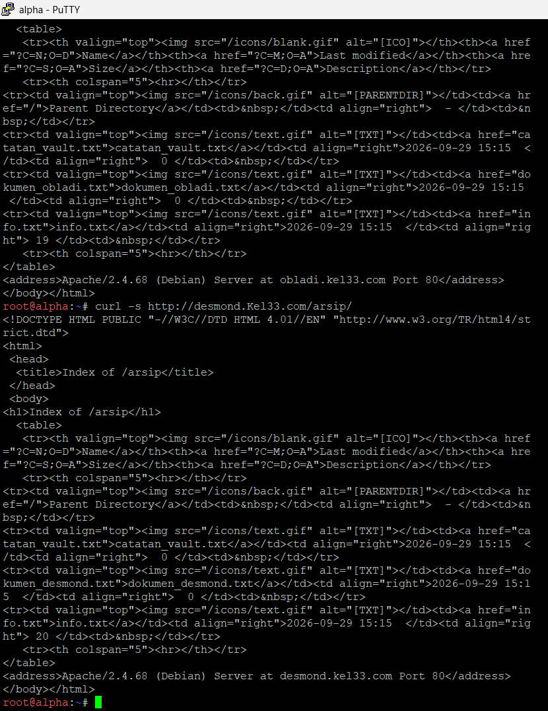

---

## Soal 10

### A. Penjelasan
Membangun web server dinamis menggunakan Nginx dan PHP-FPM pada node backend Core (`oblada` dan `molly`), serta menerapkan aturan URL rewriting (`clean URL`) agar halaman `profil.php` dapat diakses langsung tanpa ekstensi `.php`.

### B. Konfigurasi
```sh
# Conf ke Oblada & Molly
up which nginx || (rm -f /etc/resolv.conf && echo "nameserver 192.168.122.1" > /etc/resolv.conf && apt-get update && apt-get install -y nginx php-fpm)
up mkdir -p /var/www/core
up echo '<?php echo "<h1>Beranda Core - Oblada</h1><p>Selamat datang di layanan web dinamis Core.</p>"; ?>' > /var/www/core/index.php
up echo '<?php echo "<h1>Profil Core - Oblada</h1><p>Halaman profil berhasil diakses via rewrite clean URL tanpa .php</p>"; ?>' > /var/www/core/profil.php
up /etc/init.d/php*-fpm start 2>/dev/null
up sh -c 'SOCK=$(ls /run/php/php*-fpm.sock | head -n 1); echo "server { listen 80; server_name core.Kel33.com oblada.Kel33.com; root /var/www/core; index index.php index.html; location / { try_files \$uri \$uri/ \$uri.php?\$args; } location ~ \.php\$ { include snippets/fastcgi-php.conf; fastcgi_pass unix:$SOCK; } }" > /etc/nginx/sites-available/core'
up rm -f /etc/nginx/sites-enabled/default
up ln -sf /etc/nginx/sites-available/core /etc/nginx/sites-enabled/core
up /etc/init.d/php*-fpm restart 2>/dev/null
up /etc/init.d/nginx restart 2>/dev/null
```

Nginx dikonfigurasi untuk mem-proxy request skrip berekstensi `.php` ke UNIX domain socket PHP-FPM yang aktif. Pada blok `location /`, diterapkan arahan `try_files $uri $uri/ $uri.php?$args;`. Direktif ini memungkinkan Nginx mencari file berekstensi `.php` yang cocok saat klien meminta path URL tanpa ekstensi (seperti `/profil`).

### C. Pengujian

* Uji Akses Halaman Beranda Dinamis (Oblada & Molly)
```sh
curl -s http://oblada.Kel33.com/
curl -s http://molly.Kel33.com/
```
  Expected Output:
  Menampilkan luaran HTML hasil eksekusi kode PHP: `<h1>Beranda Core - Oblada</h1>...`.
  Membuktikan: Integrasi Nginx FastCGI dengan PHP-FPM berhasil mengeksekusi skrip PHP.

* Uji Clean URL Rewrite Halaman Profil Tanpa `.php`
```sh
curl -s http://oblada.Kel33.com/profil
curl -s http://molly.Kel33.com/profil
```
  Expected Output:
  Menampilkan respons halaman: `<h1>Profil Core - Oblada</h1><p>Halaman profil berhasil diakses via rewrite clean URL tanpa .php</p>`.
  Membuktikan: Direktif `try_files` Nginx sukses meretrieve skrip `profil.php` secara mulus melalui endpoint `/profil`.

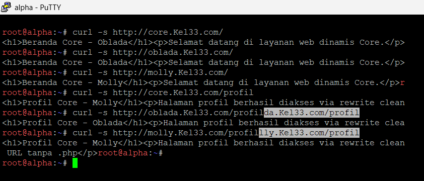

---

## Soal 11

### A. Penjelasan
Mengonfigurasi reverse proxy dan load balancer dengan algoritma Round-Robin pada node `abbey` (Nginx) menuju backend Core (`oblada` & `molly`), serta pada node `penny` (Apache) menuju backend Vault (`obladi` & `desmond`), dilengkapi dengan penerusan header klien (`Host`, `X-Real-IP`, `X-Forwarded-For`) dan pencatatan log IP asli di backend.

### B. Konfigurasi
```sh
# Conf ke Abbey
up echo 'upstream core_cluster {' > /etc/nginx/sites-available/core-proxy
up echo '    server 10.80.5.6:80;' >> /etc/nginx/sites-available/core-proxy
up echo '    server 10.80.5.7:80;' >> /etc/nginx/sites-available/core-proxy
up echo '}' >> /etc/nginx/sites-available/core-proxy
up echo 'server {' >> /etc/nginx/sites-available/core-proxy
up echo '    listen 80;' >> /etc/nginx/sites-available/core-proxy
up echo '    server_name static.Kel33.com;' >> /etc/nginx/sites-available/core-proxy
up echo '    location / {' >> /etc/nginx/sites-available/core-proxy
up echo '        proxy_pass http://core_cluster;' >> /etc/nginx/sites-available/core-proxy
up echo '        proxy_set_header Host $host;' >> /etc/nginx/sites-available/core-proxy
up echo '        proxy_set_header X-Real-IP $remote_addr;' >> /etc/nginx/sites-available/core-proxy
up echo '        proxy_set_header X-Forwarded-For $proxy_add_x_forwarded_for;' >> /etc/nginx/sites-available/core-proxy
up echo '    }' >> /etc/nginx/sites-available/core-proxy
up echo '}' >> /etc/nginx/sites-available/core-proxy
up ln -sf /etc/nginx/sites-available/core-proxy /etc/nginx/sites-enabled/core-proxy
up /etc/init.d/nginx restart 2>/dev/null

# Conf ke Penny
up a2enmod proxy proxy_http proxy_balancer lbmethod_byrequests headers 2>/dev/null
up echo '<VirtualHost *:80>' > /etc/apache2/sites-available/vault-proxy.conf
up echo '    ServerName www.Kel33.com' >> /etc/apache2/sites-available/vault-proxy.conf
up echo '    ServerAlias Kel33.com' >> /etc/apache2/sites-available/vault-proxy.conf
up echo '    ProxyPreserveHost On' >> /etc/apache2/sites-available/vault-proxy.conf
up echo '    RequestHeader set X-Real-IP "%{REMOTE_ADDR}e"' >> /etc/apache2/sites-available/vault-proxy.conf
up echo '    <Proxy balancer://vaultcluster>' >> /etc/apache2/sites-available/vault-proxy.conf
up echo '        BalancerMember http://10.80.5.4:80' >> /etc/apache2/sites-available/vault-proxy.conf
up echo '        BalancerMember http://10.80.5.5:80' >> /etc/apache2/sites-available/vault-proxy.conf
up echo '    </Proxy>' >> /etc/apache2/sites-available/vault-proxy.conf
up echo '    ProxyPass / balancer://vaultcluster/' >> /etc/apache2/sites-available/vault-proxy.conf
up echo '    ProxyPassReverse / balancer://vaultcluster/' >> /etc/apache2/sites-available/vault-proxy.conf
up echo '</VirtualHost>' >> /etc/apache2/sites-available/vault-proxy.conf
up a2ensite vault-proxy 2>/dev/null
up /etc/init.d/apache2 restart 2>/dev/null

# Conf ke Obladi & Desmond
up mkdir -p /var/log/apache2
up sed -i 's/LogFormat "%h %l %u %t \\"%r\\" %>s %O/LogFormat "%h (%{X-Forwarded-For}i) %l %u %t \\"%r\\" %>s %O/g' /etc/apache2/apache2.conf
up /etc/init.d/apache2 restart 2>/dev/null

# Conf ke Oblada & Molly
up echo '<?php print_r(getallheaders()); ?>' > /var/www/core/headers.php
```

Di node `abbey`, Nginx mendefinisikan blok `upstream core_cluster` yang mendistribusikan beban ke backend `10.80.5.6` dan `10.80.5.7` secara seimbang serta menyisipkan header forwarding. Di node `penny`, Apache mengaktifkan modul `proxy_balancer` dengan metode `lbmethod_byrequests` untuk mendistribusikan trafik `www.Kel33.com` ke node `obladi` dan `desmond`. Backend Core menyediakan file `headers.php` untuk memvalidasi header yang diterima, dan backend Vault menyesuaikan `LogFormat` Apache agar mencatat IP asli klien dari header `X-Forwarded-For`.

### C. Pengujian

* Uji Round-Robin Load Balancing Core (Abbey -> Oblada & Molly)
```sh
for i in {1..4}; do curl -s http://static.Kel33.com/profil | grep -o "Profil Core - [^<]*"; sleep 0.2; done
```
  Expected Output:
  `Profil Core - Oblada`
  `Profil Core - Molly`
  `Profil Core - Oblada`
  `Profil Core - Molly`
  Membuktikan: Reverse proxy Nginx pada `abbey` berhasil mendistribusikan permintaan secara bergantian (Round-Robin) ke kedua backend Core.

* Uji Round-Robin Load Balancing Vault (Penny -> Obladi & Desmond)
```sh
for i in {1..4}; do curl -s http://www.Kel33.com/arsip/ | grep -o "dokumen_[^.]*"; sleep 0.2; done
```
  Expected Output:
  `dokumen_obladi`
  `dokumen_desmond`
  `dokumen_obladi`
  `dokumen_desmond`
  Membuktikan: Modul balancer Apache pada `penny` berhasil membagi beban request secara seimbang ke node `obladi` dan `desmond`.

* Uji Forwarding Header Host & Real IP pada Backend Core
```sh
curl -s http://static.Kel33.com/headers.php
```
  Expected Output:
  Struktur array PHP yang memuat:
  `[Host] => static.Kel33.com`
  `[X-Real-Ip] => 10.80.x.x`
  `[X-Forwarded-For] => 10.80.x.x`
  Membuktikan: Header alamat IP asli klien dan host domain diteruskan utuh oleh proxy `abbey` ke server backend.

* Uji Pencatatan Log IP Asli Klien pada Backend Desmond
```sh
# Dijalankan dari klien bebas:
curl -s http://www.Kel33.com/arsip/

# Dijalankan di terminal node desmond:
tail -n 2 /var/log/apache2/access.log
```
  Expected Output:
  Baris log akses Apache yang menampilkan IP asli klien di dalam tanda kurung header (`%{X-Forwarded-For}i`) bersama dengan IP reverse proxy.
  Membuktikan: Backend Apache berhasil mengekstrak dan mencatat IP asal pengunjung dari header proxy.

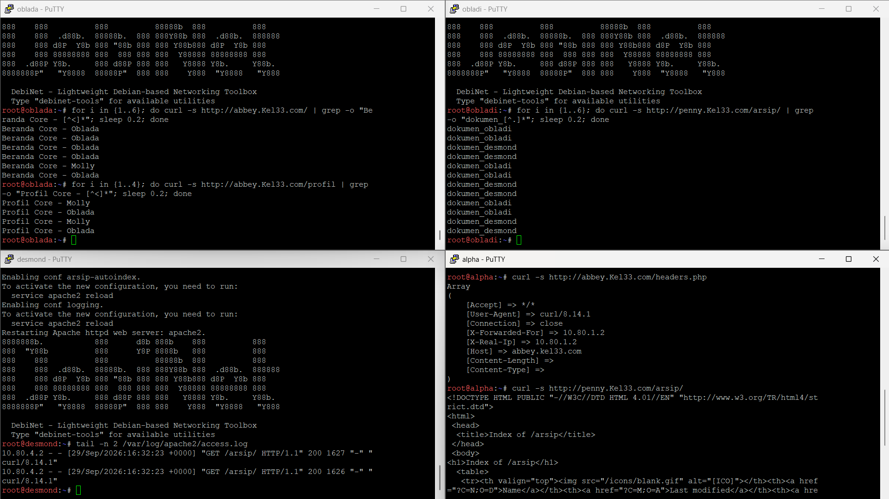

---

## Soal 12

### A. Penjelasan
Membatasi akses ke path `/admin` pada server `penny` (`www.Kel33.com/admin/`) menggunakan HTTP Basic Authentication, dengan kredensial pengguna `prabs` dan password `pakar_pinter_jadi_gob***`.

### B. Konfigurasi
```sh
# Conf ke Penny
up which htpasswd || (rm -f /etc/resolv.conf && echo "nameserver 192.168.122.1" > /etc/resolv.conf && apt-get update && apt-get install -y apache2-utils)
up mkdir -p /var/www/penny/admin
up echo "<h1>Dokumen Rahasia Sindikat Penny</h1><p>Akses berhasil diberikan ke path rahasia /admin.</p>" > /var/www/penny/admin/index.html
up htpasswd -bc /etc/apache2/.htpasswd prabs 'pakar_pinter_jadi_gob***' 2>/dev/null
up a2enmod auth_basic authn_file authz_user 2>/dev/null
up echo '    Alias /admin /var/www/penny/admin' >> /etc/apache2/sites-available/vault-proxy.conf
up echo '    <Directory /var/www/penny/admin>' >> /etc/apache2/sites-available/vault-proxy.conf
up echo '        AuthType Basic' >> /etc/apache2/sites-available/vault-proxy.conf
up echo '        AuthName "Restricted Admin Area"' >> /etc/apache2/sites-available/vault-proxy.conf
up echo '        AuthUserFile /etc/apache2/.htpasswd' >> /etc/apache2/sites-available/vault-proxy.conf
up echo '        Require valid-user' >> /etc/apache2/sites-available/vault-proxy.conf
up echo '    </Directory>' >> /etc/apache2/sites-available/vault-proxy.conf
up echo '    ProxyPass /admin !' >> /etc/apache2/sites-available/vault-proxy.conf
```

File kredensial `/etc/apache2/.htpasswd` dibuat dengan perintah `htpasswd`. Direktif `ProxyPass /admin !` ditambahkan agar Apache tidak meneruskan request path `/admin` ke balancer backend, melainkan dialihkan secara lokal via `Alias /admin`. Blok `<Directory>` mengaktifkan `AuthType Basic` dan membatasi akses hanya untuk pengguna yang terdaftar di berkas `.htpasswd`.

### C. Pengujian

* Uji Akses Tanpa Autentikasi
```sh
curl -i http://www.Kel33.com/admin/
```
  Expected Output:
  Header status respons:
  `HTTP/1.1 401 Unauthorized`
  `WWW-Authenticate: Basic realm="Restricted Admin Area"`
  Membuktikan: Direktori `/admin` terlindungi dan menolak setiap permintaan anonim.

* Uji Akses dengan Kredensial Salah
```sh
curl -i -u prabs:'pakar_pinter_beneran_pinter' http://www.Kel33.com/admin/
```
  Expected Output:
  Header status respons:
  `HTTP/1.1 401 Unauthorized`
  Membuktikan: Mekanisme autentikasi berhasil menolak kombinasi username dan password yang tidak cocok.

* Uji Akses dengan Kredensial Sah
```sh
curl -i -u prabs:'pakar_pinter_jadi_gob***' http://www.Kel33.com/admin/
```
  Expected Output:
  `HTTP/1.1 200 OK`
  `...`
  `<h1>Dokumen Rahasia Sindikat Penny</h1><p>Akses berhasil diberikan ke path rahasia /admin.</p>`
  Membuktikan: Hak akses berhasil divalidasi dan konten rahasia disajikan kepada pengguna yang sah.

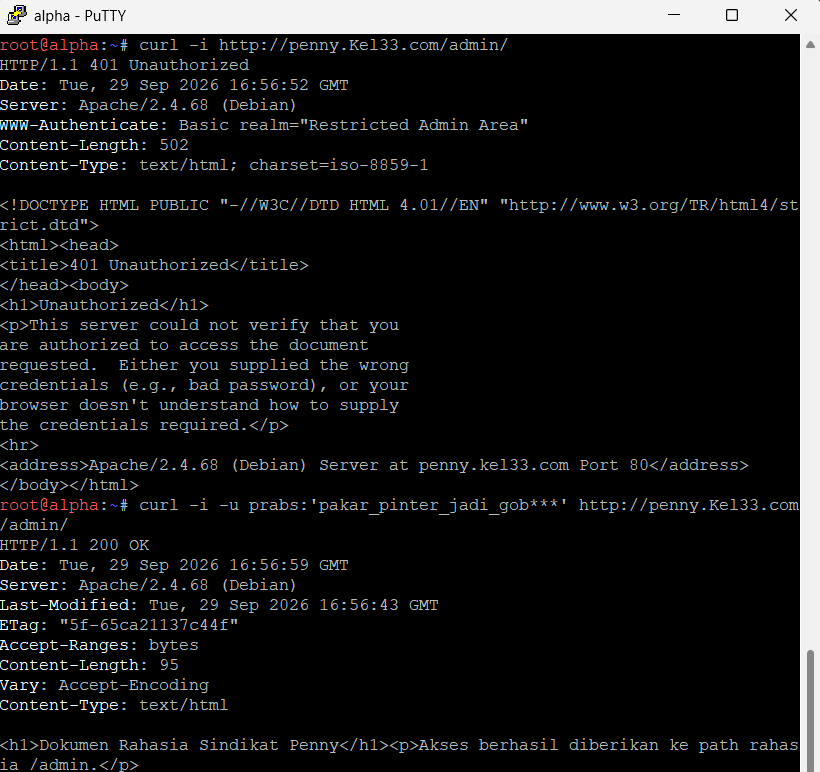

---

## Soal 13

### A. Penjelasan
Mengonfigurasi pengalihan (redirection) lalu lintas web: pengalihan permanen (HTTP 301) dari domain `penny.Kel33.com` dan IP `10.80.4.2` ke `http://www.Kel33.com/` pada node `penny`, serta pengalihan sementara (HTTP 302) dari domain `abbey.Kel33.com` dan IP `10.80.3.2` ke `http://static.Kel33.com/` pada node `abbey`.

### B. Konfigurasi
```sh
# Conf ke Penny
up a2enmod rewrite 2>/dev/null
up echo '<VirtualHost *:80>' > /etc/apache2/sites-available/redirect-penny.conf
up echo '    ServerName penny.Kel33.com' >> /etc/apache2/sites-available/redirect-penny.conf
up echo '    ServerAlias 10.80.4.2' >> /etc/apache2/sites-available/redirect-penny.conf
up echo '    RewriteEngine On' >> /etc/apache2/sites-available/redirect-penny.conf
up echo '    RewriteRule ^(.*)$ http://www.Kel33.com$1 [R=301,L]' >> /etc/apache2/sites-available/redirect-penny.conf
up echo '</VirtualHost>' >> /etc/apache2/sites-available/redirect-penny.conf
up a2ensite redirect-penny 2>/dev/null
up /etc/init.d/apache2 restart 2>/dev/null

# Conf ke Abbey
up echo 'server {' >> /etc/nginx/sites-available/core-proxy
up echo '    listen 80;' >> /etc/nginx/sites-available/core-proxy
up echo '    server_name abbey.Kel33.com 10.80.3.2;' >> /etc/nginx/sites-available/core-proxy
up echo '    return 302 http://static.Kel33.com$request_uri;' >> /etc/nginx/sites-available/core-proxy
up echo '}' >> /etc/nginx/sites-available/core-proxy
up /etc/init.d/nginx restart 2>/dev/null
```

Di node `penny`, modul Apache `mod_rewrite` diaktifkan untuk menangkap seluruh permintaan yang masuk melalui host `penny.Kel33.com` atau IP `10.80.4.2`, lalu melempar kode status pengalihan permanen `[R=301,L]` menuju `http://www.Kel33.com/`. Di node `abbey`, Nginx menambahkan blok `server` baru yang mendengarkan request dari `abbey.Kel33.com` atau IP `10.80.3.2`, lalu langsung mengembalikan arahan `return 302` menuju `http://static.Kel33.com$request_uri`.

### C. Pengujian

* Uji Pengalihan Permanen 301 Domain Penny
```sh
curl -I http://penny.Kel33.com/
```
  Expected Output:
  `HTTP/1.1 301 Moved Permanently`
  `Location: http://www.Kel33.com/`
  Membuktikan: Request berbasis nama domain pada `penny` sukses dialihkan secara permanen menuju `www.Kel33.com`.

* Uji Pengalihan Permanen 301 Alamat IP Penny
```sh
curl -I http://10.80.4.2/
```
  Expected Output:
  `HTTP/1.1 301 Moved Permanently`
  `Location: http://www.Kel33.com/`
  Membuktikan: Akses langsung ke IP fisik `penny` juga dialihkan secara otomatis ke domain utama.

* Uji Pengalihan Sementara 302 Domain Abbey
```sh
curl -I http://abbey.Kel33.com/
```
  Expected Output:
  `HTTP/1.1 302 Moved Temporarily`
  `Location: http://static.Kel33.com/`
  Membuktikan: Permintaan berbasis domain pada `abbey` berhasil diarahkan sementara ke `static.Kel33.com`.

* Uji Pengalihan Sementara 302 Alamat IP Abbey
```sh
curl -I http://10.80.3.2/
```
  Expected Output:
  `HTTP/1.1 302 Moved Temporarily`
  `Location: http://static.Kel33.com/`
  Membuktikan: Akses langsung ke IP antarmuka `abbey` dialihkan secara sementara dengan header HTTP 302.

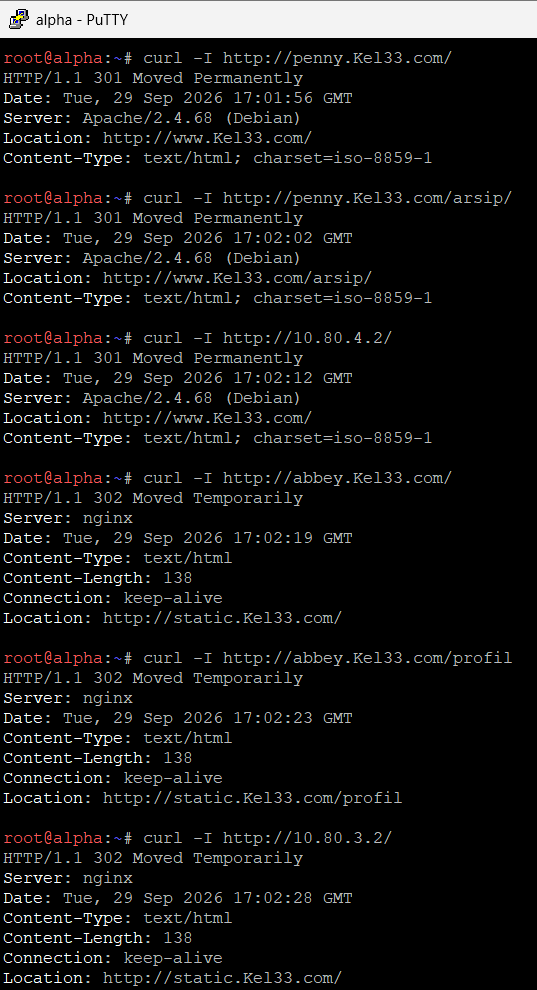

## SOAL 14
Memastikan bahwa jejak akses tidak dipalsukan oleh sistem. Setiap server web di area vault (obladi, desmond) maupun area core (oblada, molly) harus mencatat alamat IP asli milik client (pengunjung) yang diteruskan oleh gerbang (Penny atau Abbey), bukan mencatat alamat IP dari gerbang itu sendiri.   Langkah konfigurasi yang dilakukan pada setiap server backend mencakup:
1. Menambahkan format log kustom (custom_log) pada berkas utama `/etc/nginx/nginx.conf` yang memanfaatkan variabel $http_x_forwarded_for untuk membaca IP asli pengunjung.   
2. Mengonfigurasi blok server pada `/etc/nginx/sites-available/default` agar mengarah ke direktori web dan menerapkan access log menggunakan format kustom tersebut.  
``` 
# PENNY
#!/bin/bash
apt update && apt install -y apache2 nginx

# Konfigurasi Nginx Reverse Proxy ke Obladi (10.80.5.4)
cat << 'EOF' > /etc/nginx/sites-available/default
server {
    listen 80;
    server_name Kel33.com;

    location / {
        proxy_pass http://10.80.5.4; 
        proxy_set_header Host $host;
        proxy_set_header X-Real-IP $remote_addr;
        proxy_set_header X-Forwarded-For $proxy_add_x_forwarded_for;
        proxy_set_header X-Forwarded-Proto $scheme;
     }
}
EOF

# Matikan proses yang tabrakan port jika ada, lalu jalankan Nginx
nginx -t && systemctl restart nginx || {
    # Fallback jika port 80 masih terpakai process lain
    pkill -f apache2
    systemctl restart nginx
}
```

```
#ABBEY
#!/bin/bash
apt update && apt install -y apache2 nginx

# Konfigurasi Nginx Reverse Proxy ke Desmond (10.80.5.6)
cat << 'EOF' > /etc/nginx/sites-available/default
server {
    listen 80;
    server_name Kel33.com;

    location / {
        proxy_pass http://10.80.5.6;
        proxy_set_header Host $host;
        proxy_set_header X-Real-IP $remote_addr;
        proxy_set_header X-Forwarded-For $proxy_add_x_forwarded_for;
        proxy_set_header X-Forwarded-Proto $scheme;
    }
}
EOF

nginx -t && /etc/init.d/nginx restart
```

```
#Konfigurasi di Server Backend Area Vault (obladi/desmond) & Core (oblada/molly)
#OBLADI & DESMOND
#!/bin/bash
apt update && apt install -y apache2 nginx

# Tambahkan custom log format ke nginx.conf jika belum ada
if ! grep -q "custom_log" /etc/nginx/nginx.conf; then
    sed -i '/http {/a \    log_format custom_log \x27$http_x_forwarded_for - $remote_user [$time_local] "$request" $status $body_bytes_sent "$http_referer" "$http_user_agent"\x27;' /etc/nginx/nginx.conf
fi

# Konfigurasi sites-available default
cat << 'EOF' > /etc/nginx/sites-available/default
server {
    listen 80;
    server_name Kel33.com;

    access_log /var/log/nginx/access.log custom_log;

    location / {
        root /var/www/html;
        index index.html index.htm;
    }
}
EOF

# Hentikan proses yang bentrok port, lalu restart Nginx
pkill -f apache2
nginx -t && /etc/init.d/nginx restart
```


```
#OBLADA & MOLLY
#!/bin/bash
# Tambahkan custom log format ke nginx.conf jika belum ada
if ! grep -q "custom_log" /etc/nginx/nginx.conf; then
    sed -i '/http {/a \    log_format custom_log \x27$http_x_forwarded_for - $remote_user [$time_local] "$request" $status $body_bytes_sent "$http_referer" "$http_user_agent"\x27;' /etc/nginx/nginx.conf
fi

# Konfigurasi sites-available default
cat << 'EOF' > /etc/nginx/sites-available/default
server {
    listen 80;
    server_name Kel33.com;

    access_log /var/log/nginx/access.log custom_log;

    location / {
        root /var/www/html;
        index index.html index.htm;
    }
}
EOF

nginx -t && /etc/init.d/nginx restart
```


```
#PENGUJIAN
#akses dari client ALPHA
curl http://Kel33.com

#pantau akses secara real-time di server backend (obladi, desmond, oblada, molly)
tail -f /var/log/nginx/access.log
```

1. Pada baris *access log* di server `obladi`, tercatat alamat IP `10.80.1.2` (yang merupakan IP asli dari klien `alpha`) pada bagian awal log.
2. Hal ini membuktikan bahwa *header* penerusan IP (`X-Forwarded-For`) dari gerbang *Penny* berhasil diterima dan dicatat dengan sempurna oleh server backend tanpa terjadi pemalsuan jejak akses.

## SOAL 15
Membuat jalur proxy khusus yang berdiri sendiri pada masing-masing gerbang utama. Berdasarkan ketentuan soal, langkah yang dilakukan mencakup:   
1. Pada node penny, dibuat reverse proxy untuk path /eternal yang menyajikan direktori /var/www/eternal (atau /var/www/html/eternal) dan dipastikan mampu mengeksekusi (rendering) berkas PHP menggunakan PHP-FPM.   
2. Pada node abbey, dibuat path /orion yang menyajikan direktori /var/www/orion secara murni statis tanpa memerlukan rendering PHP. 
```
#LANGKAH 1: Konfigurasi di Node penny (Path /eternal + PHP)
#PENNY
mkdir -p /var/www/html/eternal
echo '<?php echo "Selamat! Web Eternal Berhasil Jalan!"; ?>' > /var/www/html/eternal/index.php

apt-get update && apt-get install -y php8.4-fpm nginx

cat << 'EOF' > /etc/nginx/sites-available/default
server {
    listen 80;
    server_name Kel33.com;

    location /eternal {
        root /var/www/html;
        index index.php index.html index.htm;
        try_files $uri $uri/ =404;

        location ~ \.php$ {
            include snippets/fastcgi-php.conf;
            fastcgi_pass unix:/run/php/php8.4-fpm.sock;
            fastcgi_param SCRIPT_FILENAME $document_root$fastcgi_script_name;
        }
    }

    location / {
        proxy_pass http://10.80.5.4;
        proxy_set_header Host $host;
        proxy_set_header X-Real-IP $remote_addr;
        proxy_set_header X-Forwarded-For $proxy_add_x_forwarded_for;
        proxy_set_header X-Forwarded-Proto $scheme;
    }
}
EOF

killall -9 nginx 2>/dev/null || true
/etc/init.d/php8.4-fpm start
/etc/init.d/nginx start

#cek
curl -i -H "Host: Kel33.com" http://10.80.4.2/eternal/index.php
```
.png)
Saat perintah `curl -i -H "Host: Kel33.com" [http://10.80.4.2/eternal/index.php](http://10.80.4.2/eternal/index.php)` dijalankan, server merespons dengan status **HTTP/1.1 200 OK** dan berhasil menampilkan teks hasil *rendering* PHP: `Selamat! Web Eternal Berhasil Jalan!`.
```
#ABBEY
mkdir -p /var/www/orion
echo '<h1>Selamat! Konten Statis Orion Berhasil Jalan!</h1>' > /var/www/orion/index.html

cat << 'EOF' > /etc/nginx/sites-available/default
server {
    listen 80;
    server_name abbey localhost;

    location /orion {
        alias /var/www/orion/;
        index index.html index.htm;
        try_files $uri $uri/ =404;
    }
}
EOF

ln -sf /etc/nginx/sites-available/default /etc/nginx/sites-enabled/default
killall -9 nginx 2>/dev/null || true
nginx -t && /etc/init.d/nginx restart

#cek
curl -i http://localhost/orion/index.html
```
.png)
Saat perintah `curl -i http://localhost/orion/index.html` dijalankan, server merespons dengan status **HTTP/1.1 200 OK** dan sukses menampilkan berkas konten HTML statis `<h1>Selamat! Konten Statis Orion Berhasil Jalan!</h1>`.

## SOAL 16
Menguji ketahanan gerbang layanan The Mesh dalam menghadapi bombardir permintaan (stress test). Pengujian ini dilakukan menggunakan utilitas ApacheBench (ab) dari node klien Alpha.   
Parameter pengujian ditetapkan sebanyak 250 total permintaan (-n 250) dengan tingkat konkurensi sebanyak 10 permintaan bersamaan (-c 10) untuk masing-masing titik akhir utama, yaitu domain utama ([www.Kel33.com](https://www.Kel33.com)) dan path statis ([static.Kel33.com/orion/](https://static.Kel33.com/orion/)).
```
# [JALANKAN DI KLIEN ex: ALPHA]
# 1. Update repository dan instal paket apache2-utils (jika belum terinstal)
apt-get update && apt-get install -y apache2-utils

# [JALANKAN DI KLIEN ex: ALPHA]
# 2. Jalankan uji beban (Benchmarking) ke domain utama (Proxy ke Vault Cluster via Penny)
# -n 250 : total 250 request yang dikirimkan
# -c 10  : 10 request bersamaan (concurrent) per waktu
ab -n 250 -c 10 http://www.Kel33.com/

# [JALANKAN DI KLIEN ex: ALPHA]
# 3. Jalankan uji beban ke path statis Orion (via Abbey / Static)
ab -n 250 -c 10 http://static.Kel33.com/orion/
```

.png)

1. **Pengujian ke `[http://www.Kel33.com/](http://www.Kel33.com/)` (`soal16.png`):**
   * **Complete requests:** 250
   * **Failed requests:** 0
   * **Requests per second:** 1347.24 [#/sec] (rata-rata)
   * **Time per request:** 7.423 [ms] (rata-rata)

2. **Pengujian ke `[http://static.Kel33.com/orion/](http://static.Kel33.com/orion/)` (`soal16(1).png`):**
   * **Complete requests:** 250
   * **Failed requests:** 0
   * **Requests per second:** 1393.68 [#/sec] (rata-rata)
   * **Time per request:** 7.175 [ms] (rata-rata)

Seluruh permintaan sebanyak 250 *requests* pada kedua titik akhir berhasil diproses sepenuhnya oleh server gerbang (*Penny* dan *Abbey*) dengan tingkat keberhasilan 100% (0 kegagalan) serta latensi waktu respons yang sangat cepat di bawah 8 milidetik. Hal ini membuktikan bahwa ketahanan dan performa gerbang layanan *The Mesh* berada dalam kondisi yang sangat optimal.

## SOAL 17
Menambahkan catatan TXT record pada server DNS master prab untuk semua klien sayap kiri dan sayap kanan (alpha, beta, gamma, delta, epsilon). Jika DNS dikueri menggunakan tipe TXT terhadap nama domain masing-masing (contoh: alpha.Kel33.com), sistem harus mengembalikan teks berupa hostname yang bersangkutan (contoh: "alpha").
```
# 1. Daftarkan zone domain ke konfigurasi utama BIND9
cat << 'EOF' > /etc/bind/named.conf.local
zone "Kel33.com" {
    type master;
    file "/etc/bind/db.Kel33.com";
};
EOF

# 2. Buat atau perbarui file database zone domain dengan serial terbaru dan TXT record klien
cat << 'EOF' > /etc/bind/db.Kel33.com
$TTL    604800
@       IN      SOA     ns1.Kel33.com. root.Kel33.com. (
                              4         ; Serial
                         604800         ; Refresh
                          86400         ; Retry
                        2419200         ; Expire
                         604800 )       ; Negative Cache TTL

@       IN      NS      ns1.Kel33.com.
@       IN      A       10.80.4.2
ns1     IN      A       10.80.4.2
www     IN      A       10.80.4.2
static  IN      A       10.80.4.3

; --- TXT Record untuk Klien Sayap Kiri dan Kanan ---
alpha     IN      TXT     "alpha"
beta      IN      TXT     "beta"
gamma     IN      TXT     "gamma"
delta     IN      TXT     "delta"
epsilon   IN      TXT     "epsilon"
EOF

# 3. Validasi konfigurasi zone DNS agar tidak ada error
named-checkzone Kel33.com /etc/bind/db.Kel33.com

# 4. Restart layanan DNS (named)
service named restart

# 5. Uji coba di PRAB query TXT untuk memastikan berhasil mengembalikan hostname 
dig TXT alpha.Kel33.com
```

1. Validasi `named-checkzone` menyatakan zona berhasil dimuat (*loaded serial 4, OK*).
2. Pada *Answer Section* dari hasil *query* `dig TXT alpha.Kel33.com`, server DNS mengembalikan nilai teks **`alpha.Kel33.com. 604800 IN TXT "alpha"`** secara tepat.

## SOAL 18
Mengubah A record DNS milik abbey.<xxxx>.com ke alamat IP fiktif yang valid, menaikkan nilai serial SOA di server master prab agar tersinkronisasi ke server slave tedd, serta menetapkan TTL sebesar 15 detik untuk menguji masa kedaluwarsa cache DNS dalam tiga fase pencarian.
```
# 1. Perbarui file database zone domain dengan serial baru (5), TTL 15 detik untuk abbey, dan IP fiktif
cat << 'EOF' > /etc/bind/db.Kel33.com
$TTL    604800
@       IN      SOA     ns1.Kel33.com. root.Kel33.com. (
                              5         ; Serial
                         604800         ; Refresh
                          86400         ; Retry
                        2419200         ; Expire
                         604800 )       ; Negative Cache TTL

@       IN      NS      ns1.Kel33.com.
@       IN      A       10.80.4.2
ns1     IN      A       10.80.4.2
www     IN      A       10.80.4.2
static  IN      A       10.80.4.3

; --- A record abbey dengan TTL 15 detik dan IP fiktif ---
abbey   15      IN      A       192.168.99.99

; --- TXT Record Klien ---
alpha     IN      TXT     "alpha"
beta      IN      TXT     "beta"
gamma     IN      TXT     "gamma"
delta     IN      TXT     "delta"
epsilon   IN      TXT     "epsilon"
EOF

# 2. Validasi konfigurasi zone DNS agar tidak ada error
named-checkzone Kel33.com /etc/bind/db.Kel33.com

# 3. Restart layanan DNS (named) agar perubahan langsung diterapkan ke server master & slave (tedd)
service named restart

# 4. Uji coba query DNS dari klien untuk verifikasi fase TTL
dig abbey.Kel33.com
```

1. Validasi `named-checkzone` berhasil memuat zona dengan nomor serial baru (`loaded serial 5, OK`).
2. Pada *Answer Section* dari hasil *query* `dig abbey.Kel33.com`, server DNS mengembalikan nilai TTL sebesar **15** detik dengan alamat IP fiktif **`192.168.99.99`** secara akurat.

## SOAL 19
Membuat CNAME record yang melakukan binding dari domain internal outbound.<xxxx>.com menuju domain eksternal badssl.com, serta memverifikasi aksesnya menggunakan perintah curl agar menghasilkan konten yang sesuai dengan halaman badssl.com.
```
# 1. Perbarui file database zone domain dengan serial baru (6) dan CNAME record outbound menuju badssl.com
cat << 'EOF' > /etc/bind/db.Kel33.com
$TTL    604800
@       IN      SOA     ns1.Kel33.com. root.Kel33.com. (
                              6         ; Serial
                         604800         ; Refresh
                          86400         ; Retry
                        2419200         ; Expire
                         604800 )       ; Negative Cache TTL

@       IN      NS      ns1.Kel33.com.
@       IN      A       10.80.4.2
ns1     IN      A       10.80.4.2
www     IN      A       10.80.4.2
static  IN      A       10.80.4.3
abbey   15      IN      A       192.168.99.99

; --- CNAME Record menuju badssl.com ---
outbound  IN    CNAME   badssl.com.

; --- TXT Record Klien ---
alpha     IN      TXT     "alpha"
beta      IN      TXT     "beta"
gamma     IN      TXT     "gamma"
delta     IN      TXT     "delta"
epsilon   IN      TXT     "epsilon"
EOF

# 2. Validasi konfigurasi zone DNS agar tidak ada error syntax
named-checkzone Kel33.com /etc/bind/db.Kel33.com

# 3. Restart layanan DNS (named) agar CNAME record langsung aktif
service named restart

# 4. Uji coba query CNAME dan curl ke outbound.Kel33.com
dig CNAME outbound.Kel33.com
curl -s -I http://outbound.Kel33.com
```

1. Validasi `named-checkzone` menyatakan zona berhasil dimuat dengan serial **6** (*loaded serial 6, OK*).
2. *Query* `dig` menampilkan *Answer Section* di mana `outbound.Kel33.com` ter-*resolve* secara tepat menjadi *canonical name* **`badssl.com.`**.
3. Eksekusi `curl` mengembalikan header **HTTP/1.1 200 OK** dari server `badssl.com` secara mulus.

## SOAL 20
Memastikan bahwa setelah seluruh rangkaian skenario pengujian selesai, seluruh service dan konfigurasi berjalan normal kembali. Sesuai instruksi khusus, konfigurasi pada nomor 18 diabaikan dengan mengembalikan koordinat domain abbey ke alamat IP normal (10.80.4.2), menaikkan serial SOA menjadi 7, serta mendaftarkan layanan agar berstatus autostart saat node melakukan restart.
```
# 1. Perbarui file database zone domain: kembalikan IP abbey ke normal (10.80.4.2), naikkan serial SOA menjadi 7, dan pertahankan CNAME serta TXT record
cat << 'EOF' > /etc/bind/db.Kel33.com
$TTL    604800
@       IN      SOA     ns1.Kel33.com. root.Kel33.com. (
                              7         ; Serial
                         604800         ; Refresh
                          86400         ; Retry
                        2419200         ; Expire
                         604800 )       ; Negative Cache TTL

@       IN      NS      ns1.Kel33.com.
@       IN      A       10.80.4.2
ns1     IN      A       10.80.4.2
www     IN      A       10.80.4.2
static  IN      A       10.80.4.3
abbey   IN      A       10.80.4.2

; --- CNAME Record menuju badssl.com ---
outbound  IN    CNAME   badssl.com.

; --- TXT Record Klien ---
alpha     IN      TXT     "alpha"
beta      IN      TXT     "beta"
gamma     IN      TXT     "gamma"
delta     IN      TXT     "delta"
epsilon   IN      TXT     "epsilon"
EOF

# 2. Validasi konfigurasi zone DNS agar tidak ada error syntax
named-checkzone Kel33.com /etc/bind/db.Kel33.com

# 3. Restart layanan DNS (named)
service named restart

# 4. Pastikan layanan DNS dan Apache terdaftar untuk autostart saat boot (sysvinit)
update-rc.d named defaults

# 5. Cek status layanan untuk memastikan semuanya berjalan normal
service named status
```

1. Validasi `named-checkzone` berhasil memuat zona dengan serial **7** (*loaded serial 7, OK*).
2. Layanan DNS berhasil di-*restart* dan perintah `service named status` mengonfirmasi bahwa **`bind is running`** dengan normal.