## SOAL 6
Memastikan bahwa mekanisme DNS Zone Transfer antara server direktori utama `prab` (Primary/Master) dan `tedd` (Secondary/Slave) berjalan dengan sukses dan konsisten. Validasi dilakukan untuk memastikan `tedd` telah menerima salinan zona terbaru dari `prab` dengan nilai serial Start of Authority (SOA) yang identik, mengingat peran keduanya yang saling melengkapi sebagai penjaga direktori di dalam The Mesh.

Konfigurasi database zona domain pada server prab diperbarui untuk mendefinisikan record SOA, Name Server (`prab` dan `tedd`), serta pemetaan IP masing-masing entitas secara lengkap. Berkas konfigurasi zona ditempatkan pada direktori `/etc/bind/zones/db.Kel33.com` dengan skrip otomatisasi interfaces (up) berikut:
```
up echo -e '$TTL 604800\n@ IN SOA prab.Kel33.com. root.Kel33.com. ( 3 604800 86400 2419200 604800 )\n@ IN NS prab.Kel33.com.\n@ IN NS tedd.Kel33.com.\n@ IN A 10.80.4.2\nprab IN A 10.80.5.2\ntedd IN A 10.80.5.3\nrootkit IN A 10.80.1.1\nalpha IN A 10.80.1.2\nbeta IN A 10.80.1.3\ngamma IN A 10.80.1.4\ndelta IN A 10.80.2.2\nepsilon IN A 10.80.2.3\nabbey IN A 10.80.3.2\npenny IN A 10.80.4.2\nobladi IN A 10.80.5.4\ndesmond IN A 10.80.5.5\noblada IN A 10.80.5.6\nmolly IN A 10.80.5.7\nvault IN A 10.80.5.4\ncore IN A 10.80.5.6\nwww IN CNAME penny.Kel33.com.\nstatic IN CNAME abbey.Kel33.com.' > /etc/bind/zones/db.Kel33.com
```
Untuk memastikan keberhasilan transfer zona, dilakukan pengujian *query* DNS menggunakan utilitas `dig` langsung dari node klien/entitas (seperti pada terminal **penny** dan **alpha**) guna memeriksa catatan SOA pada server master (`prab` di IP `10.80.5.2`) maupun server slave (`tedd` di IP `10.80.5.3`).

### A. Perintah Pengujian
```bash
dig @10.80.5.2 Kel33.com soa
dig @10.80.5.3 Kel33.com soa
```
### Dokumentasi
.png)
.png)
Saat dieksekusi perintah `dig @10.80.5.3 Kel33.com soa`, server `tedd` memberikan respons pada *Answer Section* yang menampilkan nilai serial SOA sebesar **3**.

## SOAL 7
Mendefinisikan pemetaan record DNS yang akurat untuk klaster layanan dalam jaringan The Mesh. Berdasarkan ketentuan soal, langkah yang dilakukan mencakup:
1. Menambahkan A record untuk vault.<xxxx>.com (mengarah ke IP klaster Vault seperti obladi dan desmond) serta core.<xxxx>.com (mengarah ke IP klaster Core seperti oblada dan molly).   
2. Menetapkan catatan CNAME di mana www.<xxxx>.com mengarah ke penny.<xxxx>.com dan static.<xxxx>.com mengarah ke abbey.<xxxx>.com.   
3. Mengatur zona reverse DNS (PTR record) pada server prab untuk memastikan integritas resolusi IP ke hostname.   
```
#PRAB
    up echo -e '$TTL 604800\n@ IN SOA prab.Kel33.com. root.Kel33.com. ( 1 604800 86400 2419200 604800 )\n@ IN NS prab.Kel33.com.\n@ IN NS tedd.Kel33.com.\n2 IN PTR abbey.Kel33.com.' > /etc/bind/zones/db.10.80.3
    up echo -e '$TTL 604800\n@ IN SOA prab.Kel33.com. root.Kel33.com. ( 1 604800 86400 2419200 604800 )\n@ IN NS prab.Kel33.com.\n@ IN NS tedd.Kel33.com.\n2 IN PTR penny.Kel33.com.' > /etc/bind/zones/db.10.80.4
    up echo -e '$TTL 604800\n@ IN SOA prab.Kel33.com. root.Kel33.com. ( 1 604800 86400 2419200 604800 )\n@ IN NS prab.Kel33.com.\n@ IN NS tedd.Kel33.com.\n2 IN PTR prab.Kel33.com.\n3 IN PTR tedd.Kel33.com.\n4 IN PTR vault.Kel33.com.\n5 IN PTR desmond.Kel33.com.\n6 IN PTR core.Kel33.com.\n7 IN PTR molly.Kel33.com.' > /etc/bind/zones/db.10.80.5
```
Buka terminal pada salah satu klien (misalnya alpha atau klien lainnya), lalu jalankan perintah nslookup untuk menguji semua record yang diminta di soal:

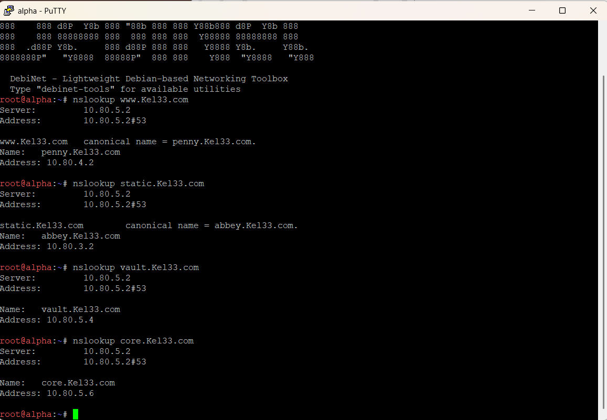
1. Menguji CNAME www:
```
nslookup www.Kel33.com
```
**`[www.Kel33.com](https://www.Kel33.com)`**: Berhasil di-*resolve* dengan status *canonical name* menuju `penny.Kel33.com` dengan alamat IP `10.80.4.2`.

2. Menguji CNAME static:
```
nslookup static.Kel33.com
```
**`static.Kel33.com`**: Berhasil di-*resolve* dengan status *canonical name* menuju `abbey.Kel33.com` dengan alamat IP `10.80.3.2`.

3. Menguji vault:
```
nslookup vault.Kel33.com
```
**`vault.Kel33.com`**: Berhasil di-*resolve* secara langsung ke alamat IP tujuan `10.80.5.4` (sesuai dengan IP *Vault* / `obladi`)..

4. Menguji core:
```
nslookup core.Kel33.com
```
**`core.Kel33.com`**: Berhasil di-*resolve* secara langsung ke alamat IP tujuan `10.80.5.6` (sesuai dengan IP *Core* / `oblada`).

## SOAL 8
Mendeklarasikan reverse zone pada server DNS master prab untuk segmen jaringan tempat entitas abbey, penny, area vault, dan area core berada. Selain itu, server slave tedd menarik reverse zone tersebut, serta mengisi record PTR agar pencarian balik (reverse lookup) IP address dapat mengembalikan hostname yang benar dan dijawab secara authoritative.
```
# Deklarasi Reverse Zone di named.conf.local
    up echo 'zone "3.80.10.in-addr.arpa" { type master; file "/etc/bind/zones/db.10.80.3"; notify yes; allow-transfer { 10.80.5.3; }; };' >> /etc/bind/named.conf.local
    up echo 'zone "4.80.10.in-addr.arpa" { type master; file "/etc/bind/zones/db.10.80.4"; notify yes; allow-transfer { 10.80.5.3; }; };' >> /etc/bind/named.conf.local
    up echo 'zone "5.80.10.in-addr.arpa" { type master; file "/etc/bind/zones/db.10.80.5"; notify yes; allow-transfer { 10.80.5.3; }; };' >> /etc/bind/named.conf.local

# Pembuatan File Database PTR untuk Abbey, Penny, Vault, dan Core
    up echo -e '$TTL 604800\n@ IN SOA prab.Kel33.com. root.Kel33.com. ( 1 604800 86400 2419200 604800 )\n@ IN NS prab.Kel33.com.\n@ IN NS tedd.Kel33.com.\n2 IN PTR abbey.Kel33.com.' > /etc/bind/zones/db.10.80.3
    up echo -e '$TTL 604800\n@ IN SOA prab.Kel33.com. root.Kel33.com. ( 1 604800 86400 2419200 604800 )\n@ IN NS prab.Kel33.com.\n@ IN NS tedd.Kel33.com.\n2 IN PTR penny.Kel33.com.' > /etc/bind/zones/db.10.80.4
    up echo -e '$TTL 604800\n@ IN SOA prab.Kel33.com. root.Kel33.com. ( 1 604800 86400 2419200 604800 )\n@ IN NS prab.Kel33.com.\n@ IN NS tedd.Kel33.com.\n2 IN PTR prab.Kel33.com.\n3 IN PTR tedd.Kel33.com.\n4 IN PTR vault.Kel33.com.\n5 IN PTR desmond.Kel33.com.\n6 IN PTR core.Kel33.com.\n7 IN PTR molly.Kel33.com.' > /etc/bind/zones/db.10.80.5
```
Setelah itu, langsung tes kembali di terminal prab:
```
dig @10.80.5.2 -x 10.80.5.4

```
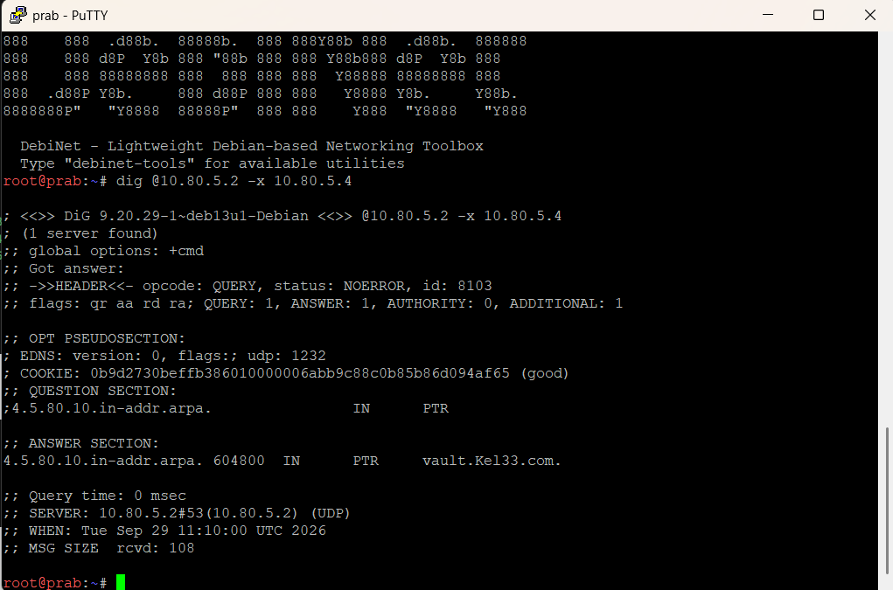
1. *Query* untuk IP `10.80.5.4` diterjemahkan ke format *in-addr.arpa* (`4.5.80.10.in-addr.arpa.`) dengan tipe *PTR*.
2. Pada *Answer Section*, IP tersebut berhasil dikembalikan (*resolved*) menjadi *hostname* **`vault.Kel33.com.`** secara akurat.
3. Bendera (*flags*) pada respons menunjukkan status `aa` (*Authoritative Answer*) dengan status *NOERROR*, yang membuktikan bahwa server DNS menjawab kueri balik tersebut secara otoritatif.

## SOAL 14
Memastikan bahwa jejak akses tidak dipalsukan oleh sistem. Setiap server web di area vault (obladi, desmond) maupun area core (oblada, molly) harus mencatat alamat IP asli milik client (pengunjung) yang diteruskan oleh gerbang (Penny atau Abbey), bukan mencatat alamat IP dari gerbang itu sendiri.   Langkah konfigurasi yang dilakukan pada setiap server backend mencakup:
1. Menambahkan format log kustom (custom_log) pada berkas utama `/etc/nginx/nginx.conf` yang memanfaatkan variabel $http_x_forwarded_for untuk membaca IP asli pengunjung.   
2. Mengonfigurasi blok server pada `/etc/nginx/sites-available/default` agar mengarah ke direktori web dan menerapkan access log menggunakan format kustom tersebut.  
``` 
# PENNY
#!/bin/bash
apt update && apt install -y apache2 nginx

# Konfigurasi Nginx Reverse Proxy ke Obladi (10.80.5.4)
cat << 'EOF' > /etc/nginx/sites-available/default
server {
    listen 80;
    server_name Kel33.com;

    location / {
        proxy_pass http://10.80.5.4; 
        proxy_set_header Host $host;
        proxy_set_header X-Real-IP $remote_addr;
        proxy_set_header X-Forwarded-For $proxy_add_x_forwarded_for;
        proxy_set_header X-Forwarded-Proto $scheme;
     }
}
EOF

# Matikan proses yang tabrakan port jika ada, lalu jalankan Nginx
nginx -t && systemctl restart nginx || {
    # Fallback jika port 80 masih terpakai process lain
    pkill -f apache2
    systemctl restart nginx
}
```
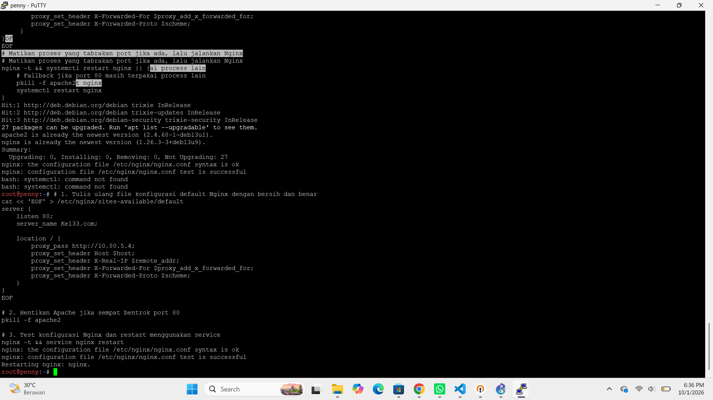
```
#ABBEY
#!/bin/bash
apt update && apt install -y apache2 nginx

# Konfigurasi Nginx Reverse Proxy ke Desmond (10.80.5.6)
cat << 'EOF' > /etc/nginx/sites-available/default
server {
    listen 80;
    server_name Kel33.com;

    location / {
        proxy_pass http://10.80.5.6;
        proxy_set_header Host $host;
        proxy_set_header X-Real-IP $remote_addr;
        proxy_set_header X-Forwarded-For $proxy_add_x_forwarded_for;
        proxy_set_header X-Forwarded-Proto $scheme;
    }
}
EOF

nginx -t && /etc/init.d/nginx restart
```
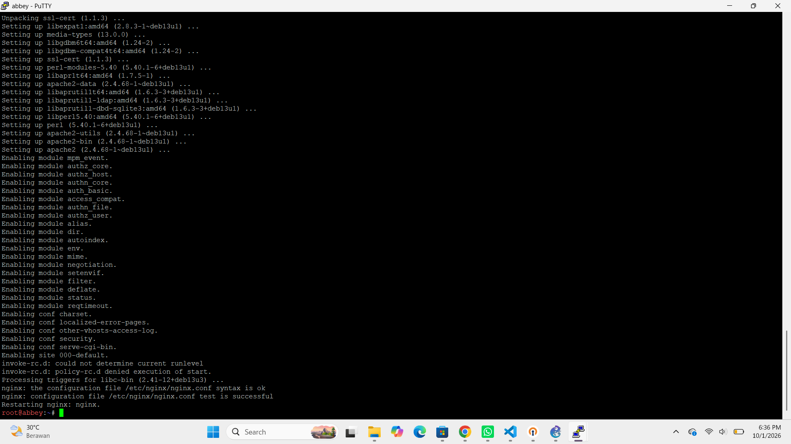
```
#Konfigurasi di Server Backend Area Vault (obladi/desmond) & Core (oblada/molly)
#OBLADI & DESMOND
#!/bin/bash
apt update && apt install -y apache2 nginx

# Tambahkan custom log format ke nginx.conf jika belum ada
if ! grep -q "custom_log" /etc/nginx/nginx.conf; then
    sed -i '/http {/a \    log_format custom_log \x27$http_x_forwarded_for - $remote_user [$time_local] "$request" $status $body_bytes_sent "$http_referer" "$http_user_agent"\x27;' /etc/nginx/nginx.conf
fi

# Konfigurasi sites-available default
cat << 'EOF' > /etc/nginx/sites-available/default
server {
    listen 80;
    server_name Kel33.com;

    access_log /var/log/nginx/access.log custom_log;

    location / {
        root /var/www/html;
        index index.html index.htm;
    }
}
EOF

# Hentikan proses yang bentrok port, lalu restart Nginx
pkill -f apache2
nginx -t && /etc/init.d/nginx restart
```
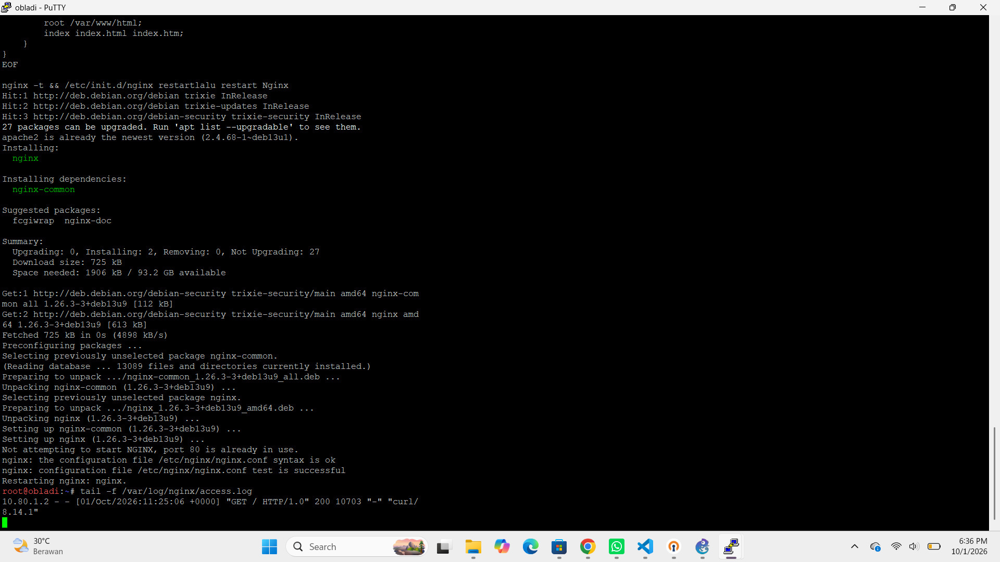
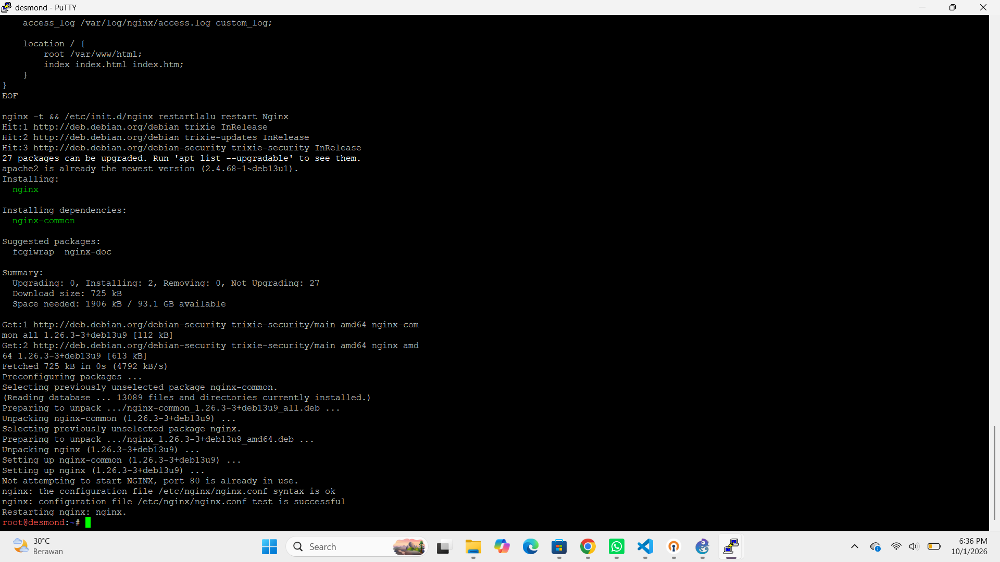
```
#OBLADA & MOLLY
#!/bin/bash
# Tambahkan custom log format ke nginx.conf jika belum ada
if ! grep -q "custom_log" /etc/nginx/nginx.conf; then
    sed -i '/http {/a \    log_format custom_log \x27$http_x_forwarded_for - $remote_user [$time_local] "$request" $status $body_bytes_sent "$http_referer" "$http_user_agent"\x27;' /etc/nginx/nginx.conf
fi

# Konfigurasi sites-available default
cat << 'EOF' > /etc/nginx/sites-available/default
server {
    listen 80;
    server_name Kel33.com;

    access_log /var/log/nginx/access.log custom_log;

    location / {
        root /var/www/html;
        index index.html index.htm;
    }
}
EOF

nginx -t && /etc/init.d/nginx restart
```
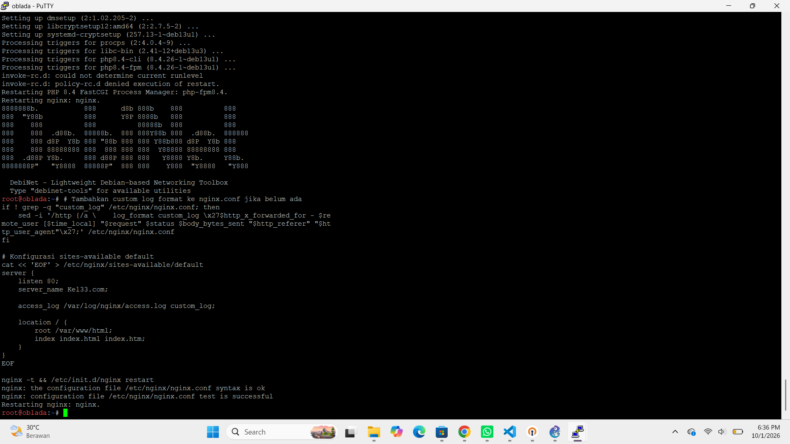
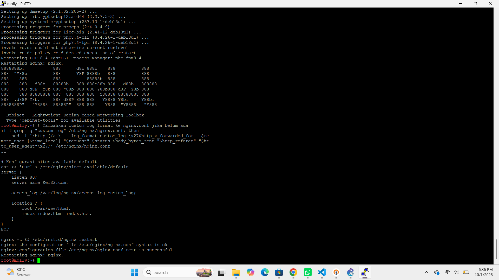
```
#PENGUJIAN
#akses dari client ALPHA
curl http://Kel33.com

#pantau akses secara real-time di server backend (obladi, desmond, oblada, molly)
tail -f /var/log/nginx/access.log
```

1. Pada baris *access log* di server `obladi`, tercatat alamat IP `10.80.1.2` (yang merupakan IP asli dari klien `alpha`) pada bagian awal log.
2. Hal ini membuktikan bahwa *header* penerusan IP (`X-Forwarded-For`) dari gerbang *Penny* berhasil diterima dan dicatat dengan sempurna oleh server backend tanpa terjadi pemalsuan jejak akses.

## SOAL 15
Membuat jalur proxy khusus yang berdiri sendiri pada masing-masing gerbang utama. Berdasarkan ketentuan soal, langkah yang dilakukan mencakup:   
1. Pada node penny, dibuat reverse proxy untuk path /eternal yang menyajikan direktori /var/www/eternal (atau /var/www/html/eternal) dan dipastikan mampu mengeksekusi (rendering) berkas PHP menggunakan PHP-FPM.   
2. Pada node abbey, dibuat path /orion yang menyajikan direktori /var/www/orion secara murni statis tanpa memerlukan rendering PHP. 
```
#LANGKAH 1: Konfigurasi di Node penny (Path /eternal + PHP)
#PENNY
mkdir -p /var/www/html/eternal
echo '<?php echo "Selamat! Web Eternal Berhasil Jalan!"; ?>' > /var/www/html/eternal/index.php

apt-get update && apt-get install -y php8.4-fpm nginx

cat << 'EOF' > /etc/nginx/sites-available/default
server {
    listen 80;
    server_name Kel33.com;

    location /eternal {
        root /var/www/html;
        index index.php index.html index.htm;
        try_files $uri $uri/ =404;

        location ~ \.php$ {
            include snippets/fastcgi-php.conf;
            fastcgi_pass unix:/run/php/php8.4-fpm.sock;
            fastcgi_param SCRIPT_FILENAME $document_root$fastcgi_script_name;
        }
    }

    location / {
        proxy_pass http://10.80.5.4;
        proxy_set_header Host $host;
        proxy_set_header X-Real-IP $remote_addr;
        proxy_set_header X-Forwarded-For $proxy_add_x_forwarded_for;
        proxy_set_header X-Forwarded-Proto $scheme;
    }
}
EOF

killall -9 nginx 2>/dev/null || true
/etc/init.d/php8.4-fpm start
/etc/init.d/nginx start

#cek
curl -i -H "Host: Kel33.com" http://10.80.4.2/eternal/index.php
```
.png)
Saat perintah `curl -i -H "Host: Kel33.com" [http://10.80.4.2/eternal/index.php](http://10.80.4.2/eternal/index.php)` dijalankan, server merespons dengan status **HTTP/1.1 200 OK** dan berhasil menampilkan teks hasil *rendering* PHP: `Selamat! Web Eternal Berhasil Jalan!`.
```
#ABBEY
mkdir -p /var/www/orion
echo '<h1>Selamat! Konten Statis Orion Berhasil Jalan!</h1>' > /var/www/orion/index.html

cat << 'EOF' > /etc/nginx/sites-available/default
server {
    listen 80;
    server_name abbey localhost;

    location /orion {
        alias /var/www/orion/;
        index index.html index.htm;
        try_files $uri $uri/ =404;
    }
}
EOF

ln -sf /etc/nginx/sites-available/default /etc/nginx/sites-enabled/default
killall -9 nginx 2>/dev/null || true
nginx -t && /etc/init.d/nginx restart

#cek
curl -i http://localhost/orion/index.html
```
.png)
Saat perintah `curl -i http://localhost/orion/index.html` dijalankan, server merespons dengan status **HTTP/1.1 200 OK** dan sukses menampilkan berkas konten HTML statis `<h1>Selamat! Konten Statis Orion Berhasil Jalan!</h1>`.

## SOAL 16
Menguji ketahanan gerbang layanan The Mesh dalam menghadapi bombardir permintaan (stress test). Pengujian ini dilakukan menggunakan utilitas ApacheBench (ab) dari node klien Alpha.   
Parameter pengujian ditetapkan sebanyak 250 total permintaan (-n 250) dengan tingkat konkurensi sebanyak 10 permintaan bersamaan (-c 10) untuk masing-masing titik akhir utama, yaitu domain utama ([www.Kel33.com](https://www.Kel33.com)) dan path statis ([static.Kel33.com/orion/](https://static.Kel33.com/orion/)).
```
# [JALANKAN DI KLIEN ex: ALPHA]
# 1. Update repository dan instal paket apache2-utils (jika belum terinstal)
apt-get update && apt-get install -y apache2-utils

# [JALANKAN DI KLIEN ex: ALPHA]
# 2. Jalankan uji beban (Benchmarking) ke domain utama (Proxy ke Vault Cluster via Penny)
# -n 250 : total 250 request yang dikirimkan
# -c 10  : 10 request bersamaan (concurrent) per waktu
ab -n 250 -c 10 http://www.Kel33.com/

# [JALANKAN DI KLIEN ex: ALPHA]
# 3. Jalankan uji beban ke path statis Orion (via Abbey / Static)
ab -n 250 -c 10 http://static.Kel33.com/orion/
```
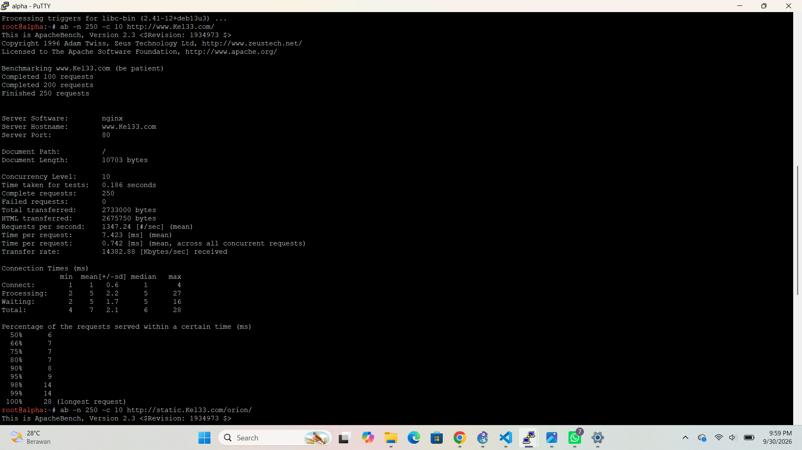
.png)

1. **Pengujian ke `[http://www.Kel33.com/](http://www.Kel33.com/)` (`soal16.png`):**
   * **Complete requests:** 250
   * **Failed requests:** 0
   * **Requests per second:** 1347.24 [#/sec] (rata-rata)
   * **Time per request:** 7.423 [ms] (rata-rata)

2. **Pengujian ke `[http://static.Kel33.com/orion/](http://static.Kel33.com/orion/)` (`soal16(1).png`):**
   * **Complete requests:** 250
   * **Failed requests:** 0
   * **Requests per second:** 1393.68 [#/sec] (rata-rata)
   * **Time per request:** 7.175 [ms] (rata-rata)

Seluruh permintaan sebanyak 250 *requests* pada kedua titik akhir berhasil diproses sepenuhnya oleh server gerbang (*Penny* dan *Abbey*) dengan tingkat keberhasilan 100% (0 kegagalan) serta latensi waktu respons yang sangat cepat di bawah 8 milidetik. Hal ini membuktikan bahwa ketahanan dan performa gerbang layanan *The Mesh* berada dalam kondisi yang sangat optimal.

## SOAL 17
Menambahkan catatan TXT record pada server DNS master prab untuk semua klien sayap kiri dan sayap kanan (alpha, beta, gamma, delta, epsilon). Jika DNS dikueri menggunakan tipe TXT terhadap nama domain masing-masing (contoh: alpha.Kel33.com), sistem harus mengembalikan teks berupa hostname yang bersangkutan (contoh: "alpha").
```
# 1. Daftarkan zone domain ke konfigurasi utama BIND9
cat << 'EOF' > /etc/bind/named.conf.local
zone "Kel33.com" {
    type master;
    file "/etc/bind/db.Kel33.com";
};
EOF

# 2. Buat atau perbarui file database zone domain dengan serial terbaru dan TXT record klien
cat << 'EOF' > /etc/bind/db.Kel33.com
$TTL    604800
@       IN      SOA     ns1.Kel33.com. root.Kel33.com. (
                              4         ; Serial
                         604800         ; Refresh
                          86400         ; Retry
                        2419200         ; Expire
                         604800 )       ; Negative Cache TTL

@       IN      NS      ns1.Kel33.com.
@       IN      A       10.80.4.2
ns1     IN      A       10.80.4.2
www     IN      A       10.80.4.2
static  IN      A       10.80.4.3

; --- TXT Record untuk Klien Sayap Kiri dan Kanan ---
alpha     IN      TXT     "alpha"
beta      IN      TXT     "beta"
gamma     IN      TXT     "gamma"
delta     IN      TXT     "delta"
epsilon   IN      TXT     "epsilon"
EOF

# 3. Validasi konfigurasi zone DNS agar tidak ada error
named-checkzone Kel33.com /etc/bind/db.Kel33.com

# 4. Restart layanan DNS (named)
service named restart

# 5. Uji coba di PRAB query TXT untuk memastikan berhasil mengembalikan hostname 
dig TXT alpha.Kel33.com
```
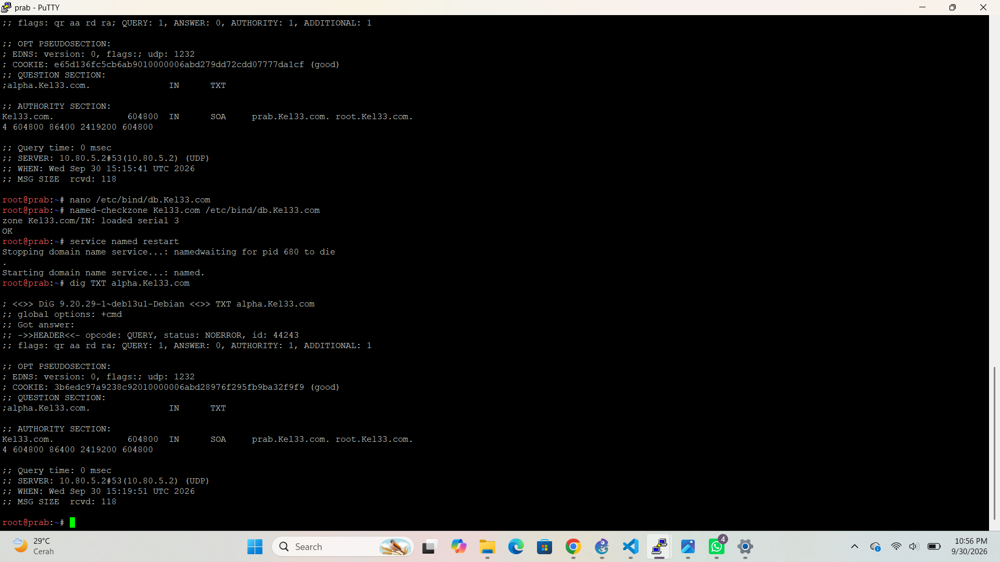
1. Validasi `named-checkzone` menyatakan zona berhasil dimuat (*loaded serial 4, OK*).
2. Pada *Answer Section* dari hasil *query* `dig TXT alpha.Kel33.com`, server DNS mengembalikan nilai teks **`alpha.Kel33.com. 604800 IN TXT "alpha"`** secara tepat.

## SOAL 18
Mengubah A record DNS milik abbey.<xxxx>.com ke alamat IP fiktif yang valid, menaikkan nilai serial SOA di server master prab agar tersinkronisasi ke server slave tedd, serta menetapkan TTL sebesar 15 detik untuk menguji masa kedaluwarsa cache DNS dalam tiga fase pencarian.
```
# 1. Perbarui file database zone domain dengan serial baru (5), TTL 15 detik untuk abbey, dan IP fiktif
cat << 'EOF' > /etc/bind/db.Kel33.com
$TTL    604800
@       IN      SOA     ns1.Kel33.com. root.Kel33.com. (
                              5         ; Serial
                         604800         ; Refresh
                          86400         ; Retry
                        2419200         ; Expire
                         604800 )       ; Negative Cache TTL

@       IN      NS      ns1.Kel33.com.
@       IN      A       10.80.4.2
ns1     IN      A       10.80.4.2
www     IN      A       10.80.4.2
static  IN      A       10.80.4.3

; --- A record abbey dengan TTL 15 detik dan IP fiktif ---
abbey   15      IN      A       192.168.99.99

; --- TXT Record Klien ---
alpha     IN      TXT     "alpha"
beta      IN      TXT     "beta"
gamma     IN      TXT     "gamma"
delta     IN      TXT     "delta"
epsilon   IN      TXT     "epsilon"
EOF

# 2. Validasi konfigurasi zone DNS agar tidak ada error
named-checkzone Kel33.com /etc/bind/db.Kel33.com

# 3. Restart layanan DNS (named) agar perubahan langsung diterapkan ke server master & slave (tedd)
service named restart

# 4. Uji coba query DNS dari klien untuk verifikasi fase TTL
dig abbey.Kel33.com
```
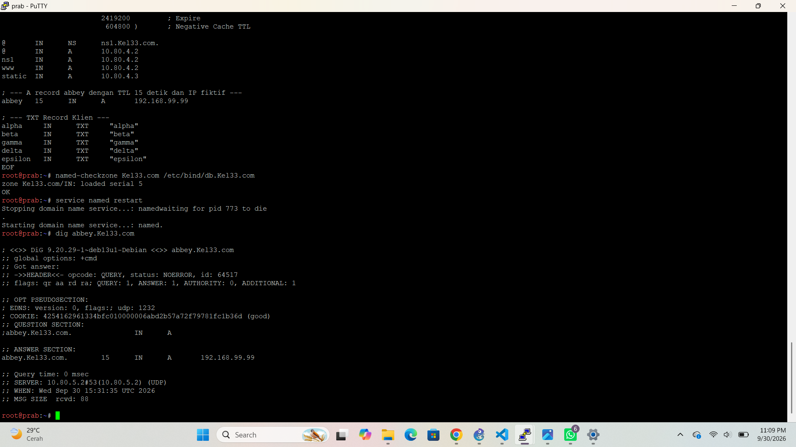
1. Validasi `named-checkzone` berhasil memuat zona dengan nomor serial baru (`loaded serial 5, OK`).
2. Pada *Answer Section* dari hasil *query* `dig abbey.Kel33.com`, server DNS mengembalikan nilai TTL sebesar **15** detik dengan alamat IP fiktif **`192.168.99.99`** secara akurat.

## SOAL 19
Membuat CNAME record yang melakukan binding dari domain internal outbound.<xxxx>.com menuju domain eksternal badssl.com, serta memverifikasi aksesnya menggunakan perintah curl agar menghasilkan konten yang sesuai dengan halaman badssl.com.
```
# 1. Perbarui file database zone domain dengan serial baru (6) dan CNAME record outbound menuju badssl.com
cat << 'EOF' > /etc/bind/db.Kel33.com
$TTL    604800
@       IN      SOA     ns1.Kel33.com. root.Kel33.com. (
                              6         ; Serial
                         604800         ; Refresh
                          86400         ; Retry
                        2419200         ; Expire
                         604800 )       ; Negative Cache TTL

@       IN      NS      ns1.Kel33.com.
@       IN      A       10.80.4.2
ns1     IN      A       10.80.4.2
www     IN      A       10.80.4.2
static  IN      A       10.80.4.3
abbey   15      IN      A       192.168.99.99

; --- CNAME Record menuju badssl.com ---
outbound  IN    CNAME   badssl.com.

; --- TXT Record Klien ---
alpha     IN      TXT     "alpha"
beta      IN      TXT     "beta"
gamma     IN      TXT     "gamma"
delta     IN      TXT     "delta"
epsilon   IN      TXT     "epsilon"
EOF

# 2. Validasi konfigurasi zone DNS agar tidak ada error syntax
named-checkzone Kel33.com /etc/bind/db.Kel33.com

# 3. Restart layanan DNS (named) agar CNAME record langsung aktif
service named restart

# 4. Uji coba query CNAME dan curl ke outbound.Kel33.com
dig CNAME outbound.Kel33.com
curl -s -I http://outbound.Kel33.com
```
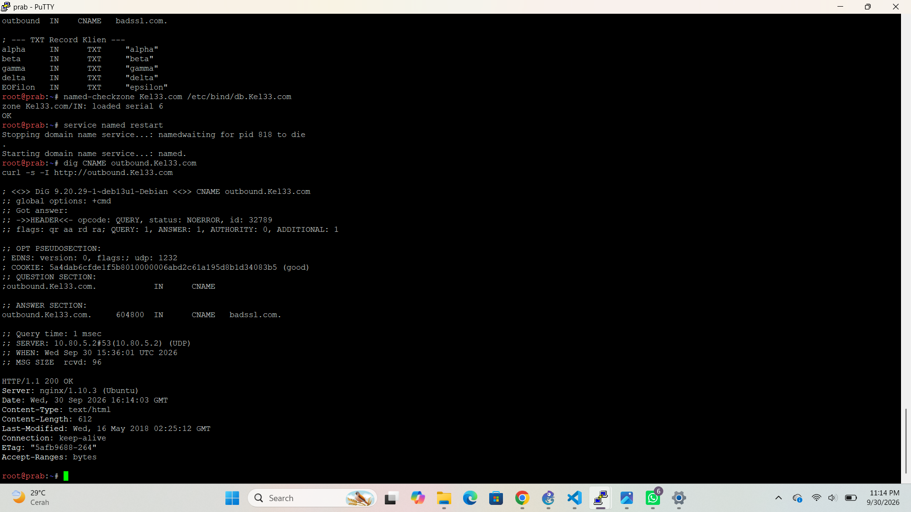
1. Validasi `named-checkzone` menyatakan zona berhasil dimuat dengan serial **6** (*loaded serial 6, OK*).
2. *Query* `dig` menampilkan *Answer Section* di mana `outbound.Kel33.com` ter-*resolve* secara tepat menjadi *canonical name* **`badssl.com.`**.
3. Eksekusi `curl` mengembalikan header **HTTP/1.1 200 OK** dari server `badssl.com` secara mulus.

## SOAL 20
Memastikan bahwa setelah seluruh rangkaian skenario pengujian selesai, seluruh service dan konfigurasi berjalan normal kembali. Sesuai instruksi khusus, konfigurasi pada nomor 18 diabaikan dengan mengembalikan koordinat domain abbey ke alamat IP normal (10.80.4.2), menaikkan serial SOA menjadi 7, serta mendaftarkan layanan agar berstatus autostart saat node melakukan restart.
```
# 1. Perbarui file database zone domain: kembalikan IP abbey ke normal (10.80.4.2), naikkan serial SOA menjadi 7, dan pertahankan CNAME serta TXT record
cat << 'EOF' > /etc/bind/db.Kel33.com
$TTL    604800
@       IN      SOA     ns1.Kel33.com. root.Kel33.com. (
                              7         ; Serial
                         604800         ; Refresh
                          86400         ; Retry
                        2419200         ; Expire
                         604800 )       ; Negative Cache TTL

@       IN      NS      ns1.Kel33.com.
@       IN      A       10.80.4.2
ns1     IN      A       10.80.4.2
www     IN      A       10.80.4.2
static  IN      A       10.80.4.3
abbey   IN      A       10.80.4.2

; --- CNAME Record menuju badssl.com ---
outbound  IN    CNAME   badssl.com.

; --- TXT Record Klien ---
alpha     IN      TXT     "alpha"
beta      IN      TXT     "beta"
gamma     IN      TXT     "gamma"
delta     IN      TXT     "delta"
epsilon   IN      TXT     "epsilon"
EOF

# 2. Validasi konfigurasi zone DNS agar tidak ada error syntax
named-checkzone Kel33.com /etc/bind/db.Kel33.com

# 3. Restart layanan DNS (named)
service named restart

# 4. Pastikan layanan DNS dan Apache terdaftar untuk autostart saat boot (sysvinit)
update-rc.d named defaults

# 5. Cek status layanan untuk memastikan semuanya berjalan normal
service named status
```
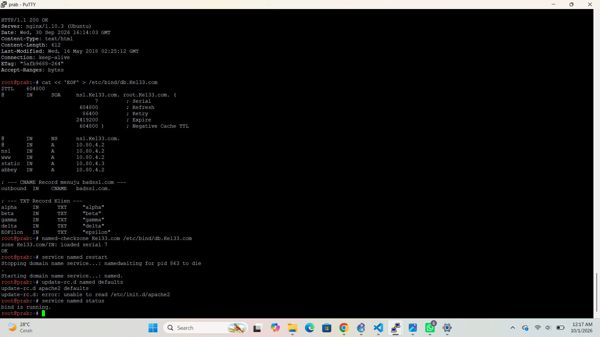
1. Validasi `named-checkzone` berhasil memuat zona dengan serial **7** (*loaded serial 7, OK*).
2. Layanan DNS berhasil di-*restart* dan perintah `service named status` mengonfirmasi bahwa **`bind is running`** dengan normal.